<div align="center">


**UNIVERSIDAD DE BUENOS AIRES**  
**Facultad de Ingeniería**  
**TA134 – Taller de Sistemas Embebidos**  

# Monitor Multiparamétrico de Signos Vitales (MMSV)

**Autores:**<br>
BONACORSI, Lautaro Quimey — Legajo: 110115<br>
BONFIGLIO, Guido Martin — Legajo: 104884<br>
TALARICO, Jonatan Axel — Legajo: 89396<br>

Este trabajo fue realizado en la Ciudad Autónoma de Buenos Aires,
entre marzo y julio de 2026.
</div>

---

# RESUMEN

En el presente trabajo se diseñó e implementó un monitor de signos vitales portátil orientado al seguimiento de pacientes en tiempo real. El dispositivo, bautizado como Monitor Multiparamétrico de Signos Vitales (MMSV), es capaz de medir de manera continua la saturación periférica de oxígeno en sangre (SpO₂) y la frecuencia cardíaca mediante el sensor óptico MAX30102.

Para alertar sobre situaciones críticas de hipoxia o desconexiones, cuenta con un sistema de alarmas médicas configurables, tanto visuales como sonoras, así como con visualización local en un display LCD de 16x2. Además, integra un módulo Bluetooth (HM-10) que transmite de forma ininterrumpida la telemetría a una aplicación móvil, lo cual permite la centralización de datos a distancia.

El desarrollo se llevó a cabo sobre una placa NUCLEO-F103RB, programada bajo una arquitectura Bare Metal guiada por eventos (Event-Triggered System). Su estructura se centra en un super-loop no bloqueante menor a 1 ms, garantizando una alta responsividad y sentando las bases de diseño para dispositivos biomédicos confiables.

---

# Registro de versiones

| Revisión | Cambios realizados | Fecha |
| :---: | --- | :---: |
| 1.0 | Creación del documento | 10/07/2026 |
| 1.1 | Redacción del documento | 13/08/2026 |

---

# Índice General

- [Capítulo 1: Introducción general](#capítulo-1-introducción-general)
  - [1.1 Introducción y análisis de necesidad](#11-introducción-y-análisis-de-necesidad)
  - [1.2 Objetivo del proyecto](#12-objetivo-del-proyecto)
  - [1.3 Objetivos específicos](#13-objetivos-específicos)
  - [1.4 Proyectos similares y selección de proyecto](#14-proyectos-similares-y-selección-de-proyecto)
  - [1.5 Diagrama en bloques general](#15-diagrama-en-bloques-general)
  - [1.6 Alcance y limitaciones](#16-alcance-y-limitaciones)
- [Capítulo 2: Introducción específica](#capítulo-2-introducción-específica)
  - [2.1 Requisitos](#21-requisitos)
  - [2.2 Casos de uso](#22-casos-de-uso)
- [Capítulo 3: Diseño e implementación](#capítulo-3-diseño-e-implementación)
  - [3.1 Arquitectura general](#31-arquitectura-general)
  - [3.2 Diseño de hardware](#32-diseño-de-hardware)
  - [3.3 Diseño de software](#33-diseño-de-software)
- [Capítulo 4: Ensayos y resultados](#capítulo-4-ensayos-y-resultados)
  - [4.1 Pruebas funcionales y de integración](#41-pruebas-funcionales-y-de-integración)
  - [4.2 Análisis de memoria](#42-análisis-de-memoria)
  - [4.3 Medición y análisis de tiempos (WCET)](#43-medición-y-análisis-de-tiempos-wcet)
  - [4.4 Cálculo del factor de uso de CPU (U)](#44-cálculo-del-factor-de-uso-de-cpu-u)
  - [4.5 Medición y análisis de consumo](#45-medición-y-análisis-de-consumo)
- [Capítulo 5: Conclusiones](#capítulo-5-conclusiones)
- [Capítulo 6: Uso de herramientas de IA](#capítulo-6-uso-de-herramientas-de-ia)
- [Bibliografía](#bibliografía)

---

# CAPÍTULO 1: Introducción general

## 1.1 Introducción y análisis de necesidad

La medición de signos vitales permite obtener información básica sobre el estado de salud de una persona y detectar situaciones que requieren observación. Entre estos parámetros, la saturación periférica de oxígeno (SpO₂) y la frecuencia cardíaca pueden adquirirse de forma no invasiva mediante técnicas de fotopletismografía. Esto es fundamental para identificar tempranamente cuadros de hipoxia u otras complicaciones en pacientes.

En Argentina y en el mercado en general, los oxímetros de pulso (tipo pinza de dedo) son extremadamente comunes y económicos. Sin embargo, estos dispositivos comerciales suelen ser unidades cerradas y aisladas, sin telemetría, historial de eventos, ni integración con otros sistemas. Por otro lado, los monitores multiparamétricos utilizados en terapia intensiva son equipos muy costosos, los cuales se ilustran en la figura 1.1.

<div align="center">
  
  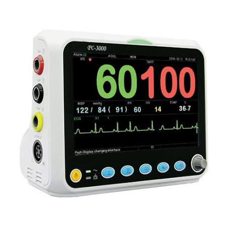
</div>
Figura 1.1: A la izquierda, un oxímetro de pulso comercial. A la derecha, un monitor multiparamétrico de alta complejidad.

El presente proyecto se destaca especialmente por ubicarse en un nicho intermedio: consiste en un dispositivo económico de sala o internación general que no solo mide, sino que centraliza la información a través de telemetría IoT (Bluetooth). Esto lo diferencia de otros sistemas similares comerciales en que alerta activamente a la guardia mediante una aplicación móvil y cuenta con una arquitectura a prueba de fallos (estado de FALLA) para maximizar la seguridad del paciente, permitiendo un monitoreo continuo de bajo costo.

En el ámbito educativo, el desarrollo de un prototipo propio de este tipo permite estudiar en conjunto la adquisición de señales biomédicas, el procesamiento digital, las interfaces de usuario, las comunicaciones y el cumplimiento de estrictas restricciones temporales.

## 1.2 Objetivo del proyecto

El objetivo de este proyecto es diseñar e implementar un monitor de signos vitales portátil orientado al seguimiento de pacientes en tiempo real. Mide la saturación de oxígeno en sangre (SpO₂) y la frecuencia cardíaca mediante el sensor MAX30102. Cuenta con un sistema de alarmas médicas configurables, visualización local en display LCD 16x2 y transmisión constante vía Bluetooth (HM-10) hacia una app móvil.

## 1.3 Objetivos específicos

Los objetivos específicos del trabajo son:

- Integrar el sensor MAX30102 con la placa NUCLEO-F103RB mediante I2C.
- Procesar las muestras roja e infrarroja para estimar SpO₂ y frecuencia cardíaca.
- Incorporar un display LCD 16 × 2 para presentar mediciones, menús y mensajes de estado.
- Implementar una interfaz local de cuatro botones para recorrer menús y modificar parámetros.
- Seleccionar el perfil inicial mediante un DIP switch de cuatro posiciones.
- Almacenar los umbrales configurados en una memoria EEPROM externa.
- Generar alarmas diferenciadas mediante LED rojo, LED amarillo y buzzer controlado por PWM.
- Transmitir telemetría y recibir comandos de configuración mediante un módulo HM-10.
- Organizar el firmware en tareas cooperativas y máquinas de estados, sin utilizar un sistema operativo.
- Evaluar experimentalmente la utilización de memoria, los tiempos de ejecución y el consumo del prototipo.

## 1.4 Proyectos similares y selección de proyecto

Para alcanzar los objetivos del trabajo, se plantearon inicialmente tres alternativas viables de monitoreo clínico, todas basadas en una arquitectura de telemetría embebida:

1. **Monitor Base (SpO₂ + Frecuencia Cardíaca):** Monitoreo continuo mediante sensado óptico (I2C) con alarmas y telemetría Bluetooth.
2. **Monitor Base + Electrocardiograma (ECG):** Se añade un front-end analógico (ej. módulo AD8232) para graficar la actividad eléctrica del corazón.
3. **Monitor Base + Presión Arterial No Invasiva (NIBP):** Se añaden bombas de aire, válvulas solenoides y sensores de presión para inflar un manguito de forma automática.

Luego de evaluar la disponibilidad de hardware, el costo, la dificultad técnica y el impacto en el proyecto, se decidió implementar el **Monitor Base (SpO₂ + Frecuencia Cardíaca)**. La opción con NIBP fue descartada debido a su altísimo costo y la dificultad de implementar dispositivos neumáticos. La opción con ECG resultó muy interesante, pero requiere un procesamiento de señales digitales (DSP) muy demandante que pondría en riesgo el requisito fundamental de mantener el sistema operando con tiempos de ejecución sumamente bajos (Super-Loop < 1 ms). 

El proyecto Base garantiza un sistema robusto, con un tiempo de implementación acorde, excelente disponibilidad de hardware y el desafío sustancial de gestionar múltiples periféricos de forma no bloqueante en un mismo bus I2C.

## 1.5 Diagrama en bloques general

El sistema basa su funcionamiento en la adquisición continua de señales fisiológicas del paciente a través del sensor óptico MAX30102, el cual estima la saturación de oxígeno y el pulso. Esta información es recolectada y evaluada por la Unidad Central (MMSV). Según el análisis de las mediciones, el equipo coordina tres vías de salida: la actualización en tiempo real de una pantalla LCD local, la activación inmediata de alarmas médicas visuales y sonoras en caso de riesgo, y la transmisión constante de la telemetría vía Bluetooth hacia una aplicación móvil para el monitoreo a distancia.

A continuación se presenta un diagrama en bloques conceptual que ilustra esta interacción en la figura 1.2:

<div align="center">

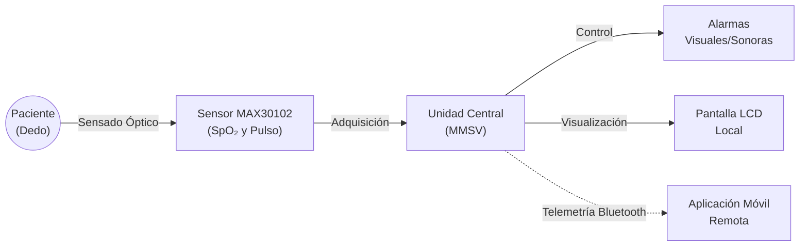

</div>
Figura 1.2: Diagrama conceptual general del sistema.


## 1.6 Alcance y limitaciones

El alcance del proyecto comprende el desarrollo de un prototipo académico funcional sobre una placa NUCLEO-F103RB y módulos comerciales. El sistema incluye adquisición, procesamiento, visualización, configuración, persistencia, alarmas y telemetría.

Las estimaciones obtenidas dependen de la colocación del dedo, el movimiento, la iluminación externa, las características del módulo sensor y el algoritmo utilizado. Por ese motivo, los resultados deben interpretarse únicamente dentro del alcance experimental del trabajo.

El MMSV no fue diseñado conforme a normas de seguridad eléctrica, compatibilidad electromagnética, biocompatibilidad o desempeño exigidas a dispositivos médicos. Tampoco fue calibrado ni validado clínicamente contra equipamiento certificado. Por lo tanto, no debe utilizarse para diagnóstico, tratamiento o monitoreo clínico real.

---

# CAPÍTULO 2: Introducción específica

## 2.1 Requisitos

A continuación, se listan los requisitos establecidos para el desarrollo en la tabla 2.1:

Tabla 2.1: Requisitos del proyecto.

| Grupo | ID | Descripción | Prioridad |
| :---- | :---- | :---- | :--- |
| **Sensores** | 1.1 | El sistema debe medir SpO₂ y Frecuencia Cardíaca de forma continua. | Alta |
| **Interfaz Local** | 2.1 | El LCD debe mostrar los valores actuales y actualizarse sin frenar la lectura de los sensores. | Alta |
| | 2.2 | El usuario debe poder modificar los umbrales de alerta y activar/desactivar las alarmas mediante el menú interactivo físico. | Alta |
| | 2.3 | El sistema debe permitir la selección de diferentes perfiles preconfigurados según la posición del DIP switch. | Media |
| | 2.4 | El usuario debe poder silenciar o desactivar las alarmas en curso presionando el botón ACK. | Baja |
| | 2.5 | Se debe permitir la activación o desactivación global de todas las alarmas mediante un interruptor del DIP switch. | Media |
| **Seguridad y Alarmas**| 3.1 | Si el SpO₂ sale del umbral guardado en la EEPROM, el sistema debe disparar una alarma crítica (LED rojo + Buzzer). | Alta |
| | 3.2 | Si la Frecuencia Cardíaca sale del umbral guardado en la EEPROM, el sistema debe disparar otra alarma diferenciada. | Alta |
| | 3.3 | Si el bus I2C no detecta al MAX30102, el sistema debe entrar en modo FALLA de forma segura y notificar el error. | Alta |
| **Comunicaciones**| 4.1 | La aplicación móvil vía Bluetooth debe mostrar en tiempo real los valores medidos de SpO₂ y Frecuencia Cardíaca. | Alta |
| | 4.2 | Se deben poder modificar los umbrales y activar/desactivar las alarmas de manera remota a través de la telemetría Bluetooth. | Media |
| **Persistencia** | 5.1 | Los cambios de configuración de los perfiles (realizados vía menú local o Bluetooth) deben guardarse en la EEPROM. | Alta |
| | 5.2 | Se debe poder reiniciar a valores de fábrica los umbrales de todos los perfiles utilizando una configuración del DIP switch. | Baja |
| **Hardware** | 6.1 | El sistema debe manejar múltiples dispositivos esclavos (LCD, EEPROM, MAX30102) sobre el mismo bus I2C sin colisiones. | Alta |

## 2.2 Casos de uso

A continuación se presentan los casos de uso principales para el sistema, desde la tabla 2.2 a la tabla 2.8.

Tabla 2.2: Caso de uso 1 - Detección y alerta de Hipoxia (SpO₂ bajo).

| Elemento | Definición |
| :---- | :---- |
| **Disparador** | El sistema calcula que el SpO₂ está por debajo del límite seguro. |
| **Precondiciones** | El sistema se encuentra en el estado NORMAL monitoreando a un paciente. |
| **Flujo principal** | 1. El sensor MAX30102 calcula un valor de SpO₂ del 88%.<br>2. El super-loop compara este valor con el umbral mínimo almacenado en la EEPROM.<br>3. El sistema detecta la anomalía y transiciona al estado ALARMA_MEDICA.<br>4. Se inicia una secuencia de pitidos rápidos no bloqueantes en el Buzzer y parpadea un LED rojo.<br>5. Se envía una trama de "ALERTA_CRITICA" por el HM-10 hacia la aplicación móvil.<br>6. El sistema se mantiene en este estado hasta que el valor se normalice o un enfermero presione un botón de "Acknowledge" (silenciar). |
| **Flujos alternativos** | a. El paciente se recupera rápidamente y el SpO₂ vuelve a niveles normales antes de que el enfermero presione el botón: el sistema cesa la alarma y retorna al estado NORMAL automáticamente. |

Tabla 2.3: Caso de uso 2 - Configuración de umbrales (SET_UP).

| Elemento | Definición |
| :---- | :---- |
| **Disparador** | El profesional de salud decide modificar los límites de alarma del equipo (ya sea de forma local o remota). |
| **Precondiciones** | El sistema está encendido y en estado NORMAL. Para la configuración remota, el módulo HM-10 debe estar emparejado con la App móvil. |
| **Flujo principal** | 1. El profesional de la salud ingresa al menú interactivo local mediante los botones o envía un comando desde la App móvil.<br>2. El sistema recibe la acción e ingresa al estado SET_UP.<br>3. Se establecen los nuevos umbrales máximos y mínimos para Frecuencia Cardíaca y SpO₂.<br>4. El sistema valida los datos y los graba en la memoria EEPROM externa por I2C.<br>5. El sistema actualiza el LCD confirmando la configuración y retorna al estado NORMAL. |
| **Flujos alternativos** | a. Se pierde la conexión Bluetooth o se cancela el menú local durante el proceso: el sistema descarta los datos parciales, mantiene los umbrales antiguos y retorna al estado NORMAL. |

Tabla 2.4: Caso de uso 3 - Falla por desconexión de sensor (Sensor Off).

| Elemento | Definición |
| :---- | :---- |
| **Disparador** | Falla de hardware o desconexión del paciente. |
| **Precondiciones** | El equipo está operando en el estado NORMAL. |
| **Flujo principal** | 1. El paciente retira el dedo del sensor óptico bruscamente, o el cable I2C del sensor se desconecta.<br>2. La rutina de lectura de registros por I2C falla (se recibe un NACK o lectura nula constante).<br>3. El sistema aborta el muestreo, detecta el error crítico y transiciona al estado FALLA.<br>4. El LCD muestra el mensaje "ERR: SENSOR DESCONECTADO".<br>5. Se activa un patrón de alarma técnica (LED rojo fijo, pitido intermitente lento). |
| **Flujos alternativos** | a. El sensor vuelve a conectarse o se reposiciona el dedo: el sistema detecta la señal nuevamente y retorna al estado NORMAL automáticamente sin necesidad de un reinicio. |

Tabla 2.5: Caso de uso 4 - Selección de Perfil de Usuario.

| Elemento | Definición |
| :---- | :---- |
| **Disparador** | El equipo se enciende. |
| **Precondiciones** | El sistema está sin alimentación. El profesional ajusta el DIP switch según el perfil del paciente deseado. |
| **Flujo principal** | 1. Se enciende el dispositivo.<br>2. En la fase de inicialización, el sistema lee el estado de las entradas asignadas al DIP switch.<br>3. Se determina el perfil asociado y se recuperan de la EEPROM los umbrales específicos de ese perfil.<br>4. El dispositivo transiciona al estado NORMAL aplicando dicha configuración. |
| **Flujos alternativos** | a. La posición del DIP switch no mapea a un perfil válido: el LCD muestra un error solicitando una selección válida antes de iniciar. |

Tabla 2.6: Caso de uso 5 - Restablecimiento de fábrica (Factory Reset).

| Elemento | Definición |
| :---- | :---- |
| **Disparador** | El operador decide borrar todas las configuraciones customizadas de umbrales. |
| **Precondiciones** | El equipo arranca con una combinación específica de "reset" en el DIP switch. |
| **Flujo principal** | 1. El sistema lee el DIP switch durante la inicialización y detecta la instrucción de restablecimiento.<br>2. Se borran o sobrescriben con parámetros por defecto todas las regiones de la memoria EEPROM que contienen la configuración de los perfiles.<br>3. El sistema bloquea el avance y solicita mediante el LCD un reinicio normal del equipo con un perfil válido. |
| **Flujos alternativos** | N/A |

Tabla 2.7: Caso de uso 6 - Telemetría remota.

| Elemento | Definición |
| :---- | :---- |
| **Disparador** | El dispositivo remoto (ej. smartphone) se empareja para monitorear las variables. |
| **Precondiciones** | El monitor se encuentra operando en estado NORMAL o ALARMA_MEDICA. |
| **Flujo principal** | 1. La aplicación móvil se conecta exitosamente al módulo HM-10 del sistema.<br>2. El microcontrolador continúa enviando por UART, de forma periódica, tramas con los valores actualizados de SpO₂ y frecuencia cardíaca.<br>3. La App recibe los datos y los visualiza en tiempo real en la pantalla del usuario remoto, incluyendo el estado de las alarmas. |
| **Flujos alternativos** | a. Pérdida de conexión Bluetooth: la transmisión de telemetría UART no se interrumpe, el sistema local sigue operando y las alarmas físicas actúan según correspondan, solo la aplicación remota notifica la desconexión. |

Tabla 2.8: Caso de uso 7 - Activación/Desactivación global de alarmas (DIP Switch).

| Elemento | Definición |
| :---- | :---- |
| **Disparador** | Se requiere silenciar globalmente el sistema de manera rápida por hardware. |
| **Precondiciones** | El equipo está encendido (en cualquier estado). |
| **Flujo principal** | 1. El usuario desliza el interruptor asignado del DIP switch a la posición de "apagado de alarmas".<br>2. El sistema, en su super-loop, detecta el cambio de nivel lógico en el puerto correspondiente.<br>3. Se bloquean los disparos a los actuadores (Buzzer y LEDs), incluso si los parámetros biomédicos salen de rango seguro. |
| **Flujos alternativos** | a. El usuario regresa el interruptor a su posición original: el sistema rehabilita inmediatamente el disparo y manejo regular de todas las alarmas. |

## 2.3 Descripción de módulos principales

### 2.3.1 Placa NUCLEO-F103RB

La NUCLEO-F103RB constituye la unidad de procesamiento y control. Integra un microcontrolador STM32F103RB con núcleo ARM Cortex-M3, memoria Flash, SRAM y periféricos como GPIO, temporizadores, I2C, UART y DMA. En el proyecto ejecuta el algoritmo de procesamiento y coordina los demás módulos.

El reloj del sistema se obtiene a partir del oscilador interno HSI y del PLL. De acuerdo con la configuración de `SystemClock_Config()`, el núcleo funciona a 64 MHz. El SysTick proporciona la base temporal de 1 ms utilizada por el ejecutor cíclico.

### 2.3.2 Sensor MAX30102 (Pulsímetro y Oxímetro)

El MAX30102 es un sensor óptico integrado fundamental para la aplicación de oximetría y medición de pulso. Su principio de funcionamiento se basa en la fotopletismografía (PPG), que mide los cambios en el volumen de sangre en los vasos capilares con cada latido del corazón. Para determinar la saturación de oxígeno (SpO₂), el sensor emite luz en dos longitudes de onda distintas: roja (típicamente 660 nm) e infrarroja (típicamente 880 nm). 

La hemoglobina oxigenada absorbe más luz infrarroja y deja pasar más luz roja, mientras que la hemoglobina desoxigenada absorbe más luz roja y deja pasar más luz infrarroja. Un fotodetector integrado mide la luz reflejada o transmitida (en este caso, reflejada) tras atravesar el tejido del paciente (como el dedo). Comparando las mediciones de absorción de ambas luces, el algoritmo puede estimar el porcentaje de SpO₂. Además, las variaciones cíclicas de la absorción debidas a los latidos permiten determinar la frecuencia cardíaca.

El sensor incorpora su propia conversión analógica-digital y un FIFO interno. Se comunica mediante I2C y dispone de una salida `INT` activa en nivel bajo. El firmware configura el sensor en modo SpO₂, adquiriendo ambos canales ópticos con muestras de 18 bits.

### 2.3.3 Display LCD 16 × 2 con PCF8574T

El display presenta las mediciones, los menús de configuración y los mensajes de error. Se utiliza junto con un expansor de puertos I2C (PCF8574), lo que permite controlar el LCD utilizando únicamente los dos pines del bus y reducir significativamente la cantidad de conexiones al microcontrolador.

La tarea de display conserva una representación local de sus dos líneas y transfiere los caracteres progresivamente. Esta estrategia distribuye la actualización en sucesivos ciclos del programa y evita reescribir continuamente toda la pantalla desde la lógica del sistema.

### 2.3.4 Conversor de niveles lógicos (TXS0108E)

Para asegurar la correcta comunicación entre componentes con distintas tensiones de alimentación se emplea un adaptador de niveles lógicos, el TXS0108E. La NUCLEO-F103RB, el MAX30102 y la memoria EEPROM operan con niveles lógicos de 3,3 V. Sin embargo, el display LCD 16x2 y su módulo PCF8574 suelen requerir 5 V para garantizar un contraste adecuado y un funcionamiento estable. 

El conversor lógico permite la interconexión bidireccional segura del bus I2C entre el dominio de 3,3 V y el de 5 V, protegiendo los pines del microcontrolador y evitando errores o degradación de señal en las líneas de datos `SDA` y reloj `SCL`.

### 2.3.5 Memoria EEPROM (AT24C32)

La EEPROM externa conectada vía I2C almacena la configuración persistente de los perfiles. Cada registro contiene una palabra de validación, los límites mínimo y máximo de SpO₂ y pulso, y el estado de habilitación de las alarmas.

Las configuraciones de los perfiles se ubican en bloques separados. Si al iniciar no se encuentra la palabra de validación esperada, el firmware aplica valores predeterminados para el perfil y solicita su almacenamiento. Las escrituras normales se realizan por interrupción y el driver verifica posteriormente la finalización del ciclo interno de escritura.

### 2.3.6 Interfaz de botones y DIP switch

La interacción local se realiza mediante cuatro pulsadores: `MENU`, `UP`, `DOWN` y `ACK`. Cada botón cuenta con una máquina de estados de antirrebote que distingue los estados estable alto, flanco descendente, estable bajo y flanco ascendente. Una pulsación validada genera un evento para la tarea de sistema.

El DIP switch permite seleccionar uno de los perfiles disponibles al iniciar. También se utiliza una combinación reservada para el restablecimiento de fábrica. La selección se evalúa durante la inicialización; si no es válida, se presenta un mensaje y se bloquea la operación hasta el siguiente reinicio.

### 2.3.7 Indicadores y buzzer

El bloque de actuación está compuesto por dos LEDs y un buzzer controlado mediante el canal 1 del temporizador TIM3 (PWM). El firmware utiliza patrones no bloqueantes basados en contadores de 1 ms.

La advertencia de pulso alterna un LED rojo y el buzzer cada 500 ms. La alarma crítica de SpO₂ utiliza otro LED rojo y alterna el buzzer de forma más rápida. Al iniciarse el equipo se ejecuta un autodiagnóstico visual y sonoro para comprobar los actuadores.

### 2.3.8 Módulo Bluetooth HM-10

El HM-10 proporciona conectividad Bluetooth Low Energy mediante una interfaz UART transparente. Se conecta a la USART1 del microcontrolador y permite transmitir de manera constante las mediciones hacia un dispositivo externo (como un smartphone) y recibir comandos de configuración remotos.

La telemetría se transmite como texto con estructura JSON. Un ejemplo de trama es:

```json
{"type":"data","spo2":97,"bpm":72,"alarm":0}
```

Los comandos recibidos utilizan un formato simple, compuesto por el prefijo `CFG`, el nombre del parámetro y su valor. Por ejemplo:

```text
CFG:SPO2_MIN:92
CFG:BPM_MAX:110
CFG:ALARM:1
```

## 2.4 Comunicación I2C

### 2.4.1 Características generales del bus

I2C (Inter-Integrated Circuit) es un bus serie síncrono de dos líneas: `SCL`, utilizada como reloj, y `SDA`, utilizada para transferir datos bidireccionalmente. Ambas señales son de colector o drenador abierto, por lo que el estado de reposo del bus es un nivel lógico alto. Esto requiere la conexión de resistencias *pull-up* a la tensión de alimentación. 

El funcionamiento general se basa en una arquitectura Maestro-Esclavo (Controller-Target). El dispositivo maestro o controlador inicia y detiene las transferencias generando condiciones de "Start" y "Stop" y suministra la señal de reloj. Cada periférico (esclavo) conectado al bus cuenta con una dirección única (generalmente de 7 bits). 

En una transacción típica, el maestro envía la dirección del esclavo con el que desea comunicarse junto con un bit adicional que indica si la operación será de lectura (1) o escritura (0). El esclavo correspondiente responde enviando un bit de reconocimiento (ACK), tras lo cual se transfieren los datos byte por byte (cada uno seguido de su respectivo ACK). Al finalizar la transferencia, el maestro libera el bus imponiendo una condición de "Stop".

En el MMSV, la NUCLEO-F103RB actúa como maestro controlador del bus I2C1 (señales asignadas a `PB6` para `SCL` y `PB7` para `SDA`). El bus se configura para operar a 100 kHz.

### 2.4.2 Dispositivos conectados

Tabla 2.9: Dispositivos conectados al bus I2C1.

| Dispositivo | Función | Dirección utilizada | Tipo de acceso |
| --- | --- | :---: | --- |
| MAX30102 | Adquisición de muestras roja e infrarroja | `0x57` de 7 bits | Lectura y escritura de registros |
| EEPROM | Persistencia de configuraciones | Según módulo utilizado | Lectura y escritura de memoria |
| LCD con PCF8574 | Visualización local | `0x27` o `0x3F` de 7 bits | Escritura de comandos y datos |

Las direcciones indicadas son direcciones de 7 bits. La biblioteca HAL del STM32 utiliza normalmente la dirección desplazada un bit a la izquierda al efectuar una transferencia.

### 2.4.3 Interconexión eléctrica

El MAX30102 y la EEPROM mantienen niveles lógicos compatibles con los 3,3 V del STM32. El display, alimentado a 5 V, requiere la utilización del ya mencionado adaptador de niveles lógicos bidireccional. 

Todos los dispositivos comparten `SCL`, `SDA` y una referencia común de masa. Antes del montaje final se debe verificar la presencia de resistencias *pull-up* en los módulos comerciales integrados, ya que la conexión en paralelo de múltiples redes de resistencias en el mismo bus puede reducir excesivamente su valor resistivo equivalente (sobrecargando los transistores que deben llevar las líneas a nivel bajo).

### 2.4.4 Administración desde el firmware

El bus I2C es un recurso compartido crítico en este proyecto. El MAX30102 y el módulo LCD utilizan transferencias bloqueantes de muy corta duración para no romper la ventana de tiempo del sistema guiado por eventos, mientras que la EEPROM dispone de operaciones por interrupción para sus ciclos de escritura (que son significativamente más lentos). 

La aplicación actualiza los drivers antes de ejecutar las tareas y cada módulo comprueba el estado del periférico antes de iniciar determinadas operaciones para evitar colisiones.

---

# CAPÍTULO 3: Diseño e implementación

## 3.1 Arquitectura general

La arquitectura del MMSV se divide en cuatro bloques funcionales:

1. **Adquisición:** obtiene las muestras ópticas del MAX30102.
2. **Procesamiento y control:** calcula SpO₂ y pulso, administra los perfiles, compara umbrales y coordina los eventos.
3. **Interfaz y actuación:** comprende botones, DIP switch, LCD, LEDs y buzzer.
4. **Comunicación y persistencia:** incluye el HM-10 y la EEPROM.

La NUCLEO-F103RB ocupa el centro del sistema y se conecta con los periféricos mediante I2C, UART, GPIO y PWM. A nivel de software, el firmware se estructura sobre una arquitectura de ejecución cíclica no bloqueante (*super-loop*), donde múltiples tareas operan simultáneamente utilizando máquinas de estados finitos guiadas por eventos, como se muestra en la figura 3.1.

<div align="center">

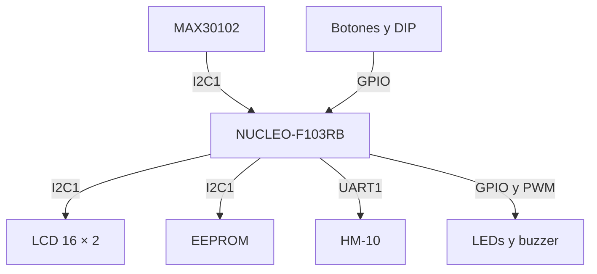

</div>
Figura 3.1: Diagrama de arquitectura general.

## 3.2 Diseño de hardware

### 3.2.1 Criterio de montaje

La integración final se realiza sobre una placa base, evitando el uso de protoboard y cables Dupont. Los módulos se conectan mediante conductores soldados y conectores, con una masa común y distribución diferenciada de 3,3 V y 5 V.

La disposición debe permitir acceder al sensor con el dedo, observar el display y los indicadores, accionar los botones y modificar el DIP switch. También debe evitar esfuerzos mecánicos sobre los conectores y cortocircuitos entre ambas líneas de alimentación, tal como se observa en la figura 3.2 y la figura 3.3.

<div align="center">
  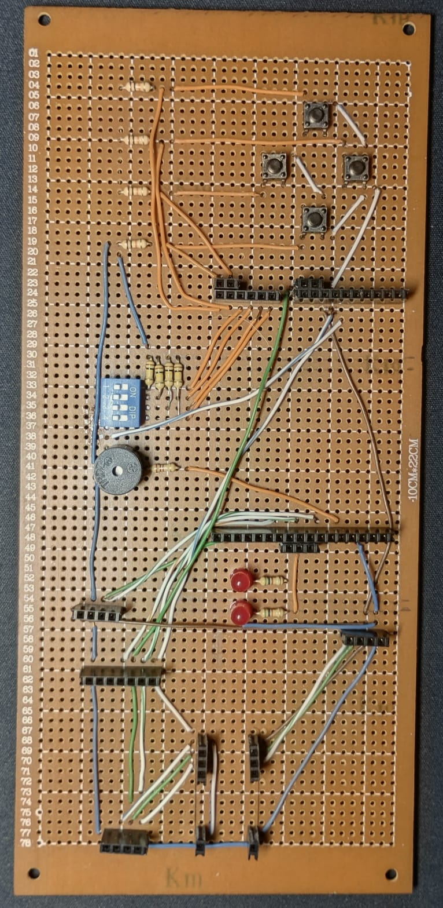
  <br>
  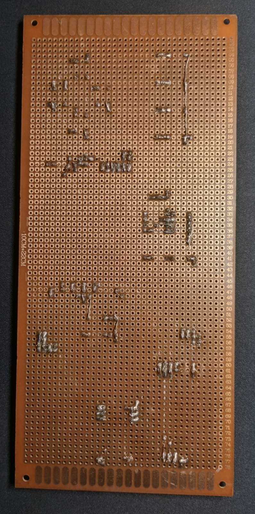
</div>
Figura 3.2: Placa base del sistema lista para el ensamble.
Figura 3.3: Cara de soldaduras demostrando el conexionado físico.

### 3.2.2 Alimentación y niveles lógicos

El STM32F103RB y el MAX30102 operan con señales de 3,3 V. El módulo LCD se alimenta con 5 V y se conecta al bus mediante adaptación bidireccional de niveles. El módulo HM-10 utilizado incorpora su propia placa de adaptación de alimentación, mientras que sus señales UART son compatibles con la lógica de 3,3 V del microcontrolador.

La masa debe ser común a todos los módulos. Antes de energizar se deben verificar continuidad, ausencia de cortocircuitos entre alimentación y masa y polaridad correcta de cada conector.

### 3.2.3 Entradas digitales

Los cuatro botones se conectan a `PC0`, `PC1`, `PC2` y `PC3`. El estado presionado corresponde a un nivel lógico alto, por lo que cada entrada requiere una resistencia *pull-down*. El DIP switch utiliza `PA0`, `PA1`, `PA4` y `PB0` con el mismo criterio eléctrico.

La salida `INT` del MAX30102 se conecta a `PB10`. Esta señal es activa en nivel bajo e informa la disponibilidad de una nueva muestra en el FIFO.

### 3.2.4 Salidas de alarma

Los LEDs se conectan a `PB1` y `PB2`, mediante resistencias limitadoras. El buzzer se controla desde `PA6`, correspondiente a `TIM3_CH1`.

Si el buzzer utilizado requiere una corriente superior a la admitida por un GPIO, debe interponerse una etapa de manejo con transistor y diodo de protección cuando corresponda. El GPIO debe utilizarse como señal de control y no como fuente directa de potencia.

### 3.2.5 Comunicaciones

El bus I2C1 utiliza `PB6` y `PB7` y conecta MAX30102, EEPROM y LCD. USART1 utiliza `PA9` y `PA10` para comunicarse con el HM-10. USART2 se encuentra vinculada al ST-LINK de la placa y se utiliza como consola de depuración a 115200 bit/s.

### 3.2.6 Pinout del sistema

La asignación detallada de pines se expone en la tabla 3.1.

Tabla 3.1: Asignación de pines del MMSV.

| Componente | Pin STM32 | Función |
| --- | :---: | --- |
| Botón MENU | `PC0` | Entrada digital |
| Botón UP | `PC1` | Entrada digital |
| Botón DOWN | `PC2` | Entrada digital |
| Botón ACK | `PC3` | Entrada digital |
| DIP 1 | `PA0` | Selección de perfil |
| DIP 2 | `PA1` | Selección de perfil |
| DIP 3 | `PA4` | Selección de perfil |
| DIP 4 | `PB0` | Selección/restablecimiento |
| LED amarillo | `PB1` | Salida digital |
| LED rojo | `PB2` | Salida digital |
| Buzzer | `PA6` | `TIM3_CH1`, salida PWM |
| MAX30102 INT | `PB10` | Entrada digital activa baja |
| I2C1 SCL | `PB6` | Reloj I2C |
| I2C1 SDA | `PB7` | Datos I2C |
| HM-10 RX | `PA9` | `USART1_TX` |
| HM-10 TX | `PA10` | `USART1_RX` |

### 3.2.7 Esquemático y montaje final

A continuación, se dividen los esquemáticos eléctricos por bloques funcionales para mayor claridad, ilustrados en las figuras 3.4, 3.5, 3.6 y 3.7:

<div align="center">
  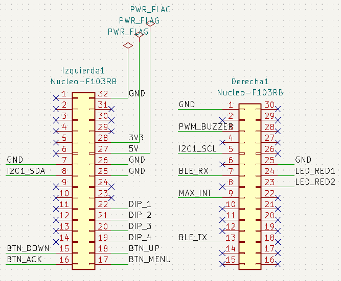
  <br>
  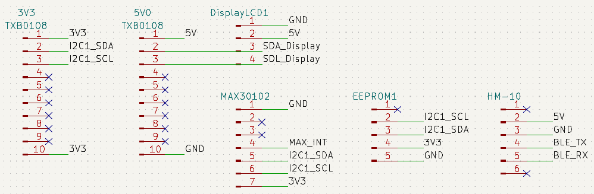
  <br>
  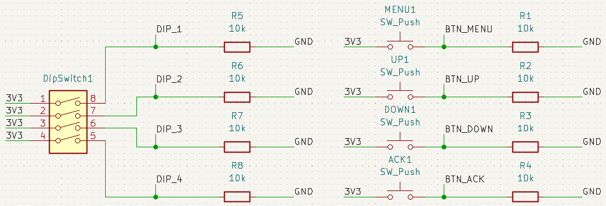
  <br>
  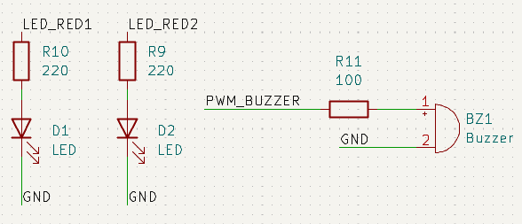
</div>
Figura 3.4: Conexión principal de la placa NUCLEO-F103RB.
Figura 3.5: Módulos I2C, módulo Bluetooth y adaptador de niveles (TXS0108E).
Figura 3.6: Resistencias pull-down para los botones locales y el DIP switch.
Figura 3.7: Circuitos de actuación (LEDs y Buzzer).

Finalmente, el prototipo ensamblado con todos los módulos montados sobre la placa base se observa en la figura 3.8:

<div align="center">
  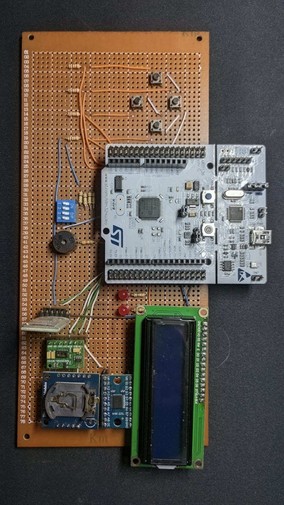
</div>
Figura 3.8: Montaje físico definitivo del sistema MMSV.

## 3.3 Diseño de software

### 3.3.1 Organización del proyecto

El proyecto se generó mediante STM32CubeMX y se desarrolla en STM32CubeIDE. El código se divide en:

- `Core/`: inicialización del microcontrolador, periféricos, interrupciones y punto de entrada.
- `Drivers/`: CMSIS y biblioteca HAL suministradas por STMicroelectronics.
- `app/inc/`: interfaces, tipos y definiciones de la aplicación.
- `app/src/`: planificador, tareas, drivers propios y algoritmos.

Esta separación evita mezclar la lógica funcional con el código de inicialización generado automáticamente. Cabe destacar que, para mantener la concisión de esta memoria, no se presentarán aquí todas las líneas de código del firmware, sino únicamente aquellos diagramas de máquinas de estado y fragmentos de código que resulte de interés explicar por su peso arquitectónico.

### 3.3.2 Ejecutor cíclico

Después de inicializar HAL, reloj y periféricos, `main()` llama a `app_init()`. A continuación ingresa en un bucle infinito que ejecuta `app_update()` y luego `__WFI()`.

El SysTick incrementa el contador global de tics cada 1 ms. `app_update()` consume los tics pendientes y, por cada uno, actualiza los drivers y las tareas registradas. Si durante una ejecución se acumula otro tic, el ciclo se repite hasta recuperar el atraso, lo cual se ilustra en la figura 3.9.

<div align="center">

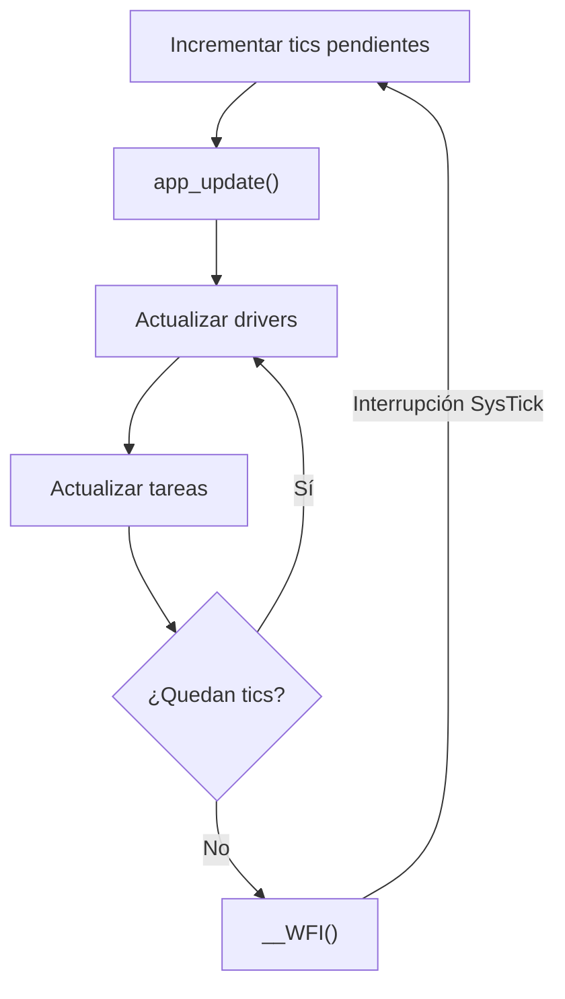

</div>
Figura 3.9: Diagrama de acción del ejecutor cíclico.


La lista de tareas contiene cinco entradas, como se detalla en la tabla 3.2:

Tabla 3.2: Tareas ejecutadas por la aplicación.

| Orden | Tarea | Responsabilidad principal |
| :---: | --- | --- |
| 1 | `task_sensor` | Lectura y antirrebote de botones |
| 2 | `task_system` | Menús, configuración, perfiles, umbrales y alarmas |
| 3 | `task_display` | Actualización progresiva del LCD |
| 4 | `task_actuator` | Patrones de LEDs y buzzer |
| 5 | `task_telemetry` | Transmisión y recepción mediante USART1 |

### 3.3.3 Comunicación por eventos

Las tareas se desacoplan mediante interfaces de eventos. Por ejemplo, la tarea de sensores no modifica directamente el menú: valida una pulsación y coloca un evento para la tarea de sistema. De igual modo, el algoritmo informa una medición nueva y la tarea de sistema decide qué presentar y qué alarma activar.

Este enfoque reduce dependencias entre módulos y permite que cada tarea conserve su propia máquina de estados. Las interfaces actuales almacenan eventos pendientes de forma acotada; por ello, el ritmo de producción de eventos debe ser compatible con su consumo dentro del ciclo.

### 3.3.4 Adquisición y procesamiento

El driver del MAX30102 se encarga de la configuración inicial del sensor: establece el modo SpO₂ (activando ambos LEDs), configura el comportamiento del FIFO interno, la frecuencia de muestreo a 100 Hz, el ancho de pulso y la amplitud de corriente para la penetración óptica. 

La lectura de datos se realiza comprobando la señal `INT` conectada al pin `PB10`. Cada vez que esta línea cae a nivel bajo (indicando nuevos datos listos), la aplicación lee seis bytes del FIFO vía I2C, ensamblando una muestra de 18 bits para el LED rojo y otra para el infrarrojo.

Estas muestras crudas se introducen en la función `algorithm_process_sample()`. Para procesar los signos vitales, el sistema emplea una adaptación en C del popular algoritmo desarrollado por *Maxim Integrated y distribuido ampliamente por SparkFun* (comúnmente utilizado en el módulo de referencia MAXREFDES117#). Este algoritmo analiza la componente continua (DC) y alterna (AC) de la fotopletismografía en ambos canales lumínicos para estimar la saturación de oxígeno, y detecta los cruces por cero de la señal de pulso para calcular la frecuencia cardíaca.

Para garantizar estabilidad y descartar errores, la capa de procesamiento en el firmware incorpora una etapa de validación de dedo, el buffer temporal y un filtrado digital IIR:

Código 3.1: Función de procesamiento y filtrado de signos vitales.
```c
void algorithm_process_sample(uint32_t red_sample, uint32_t ir_sample)
{
	/* Detección de dedo (baja reflexión infrarroja) */
	if (50000ul > ir_sample) {
		g_buffer_index = 0;
		if (true == b_finger_detected) {
			b_finger_detected = false;
			g_algo_current_spo2 = 0;
			put_event_task_system(EV_SYS_SENSOR_ERR); // Avisar desconexión
		}
		return;
	}

	g_red_buffer[g_buffer_index] = red_sample;
	g_ir_buffer[g_buffer_index] = ir_sample;
	g_buffer_index++;

	/* Cuando juntamos 4 segundos de datos (400 muestras a 100Hz), procesamos. */
	if (ALGO_BUFFER_SIZE <= g_buffer_index) {
		// ... variables locales ...

		/* Invocamos al algoritmo base (Maxim/SparkFun) */
		maxim_heart_rate_and_oxygen_saturation(
			g_ir_buffer, ALGO_BUFFER_SIZE, g_red_buffer, 
			&spo2, &valid_spo2, &bpm, &valid_bpm
		);

		/* Si el algoritmo indica lecturas válidas, aplicamos filtro IIR suave */
		if (valid_spo2 && (0 < spo2) && (100 >= spo2)) {
			if (0 == g_algo_current_spo2) g_algo_current_spo2 = spo2; 
			else g_algo_current_spo2 = (g_algo_current_spo2 * 7 + spo2) / 8;
		}

		/* Despachamos evento al sistema con los nuevos datos */
		put_event_task_system(EV_SYS_SPO2_DATA);

		/* Desplazamos la ventana: conservamos los últimos 3 segundos */
		// ...
		g_buffer_index = 300; 
	}
}
```

Como se observa en el código, el sistema acumula 4 segundos continuos de información (400 muestras a 100 Hz) para invocar al algoritmo de SparkFun de forma óptima. Luego, los nuevos valores que resultan válidos pasan por un filtro IIR paso bajo (`valor = (valor_anterior * 7 + nuevo_valor) / 8`) que suaviza las transiciones bruscas antes de generar el evento de actualización que utilizarán las tareas de alarmas y display.

### 3.3.5 Máquina de estados de la interfaz local

La tarea de sistema posee un modo normal, un modo de configuración y estados de bloqueo. En operación normal presenta las mediciones y evalúa los umbrales. El menú de configuración se divide en tres niveles:

1. Selección del parámetro fisiológico: oxímetro o pulsómetro.
2. Selección del atributo: mínimo, máximo o habilitación de alarma.
3. Modificación del valor elegido.

Todo esto se representa en la máquina de estados de la figura 3.10.

<div align="center">
  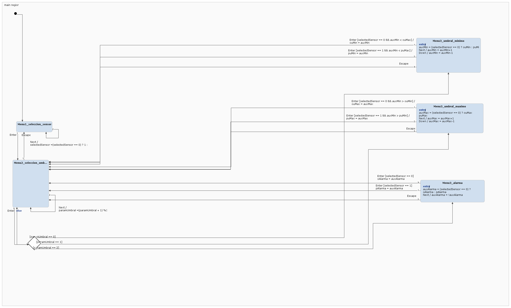
</div>
Figura 3.10: Máquina de estados de la interfaz de configuración (Set-Up local).

El siguiente fragmento de código ilustra cómo se implementa el primer menú utilizando una sentencia `switch` controlada por eventos, una estructura fundamental que se replica en todas las tareas del super-loop:

Código 3.2: Sentencia switch-case para el menú interactivo.
```c
		case ST_SYS_MENU1_SENSOR:
			if (EV_SYS_NEXT == p_task_system_dta->event) {
				g_selected_sensor = (0 == g_selected_sensor) ? 1 : 0;
				task_system_show_setup_state();
			}
			else if (EV_SYS_ENTER == p_task_system_dta->event) {
				task_system_set_setup_state(ST_SYS_MENU2_PARAMETER);
			}
			else if (EV_SYS_ESCAPE == p_task_system_dta->event) {
				task_system_save_config(); // Guardar cambios en EEPROM
				task_system_set_mode(NORMAL);
				task_system_show_normal();
			}
			break;
```

Al salir del menú principal (`MENU 1`) mediante el evento de escape, la configuración en RAM se compara con la última versión guardada. Si existen cambios, se inicia automáticamente una escritura en la EEPROM correspondiente al perfil activo.

### 3.3.6 Perfiles y persistencia

Durante el arranque se interpretan las entradas del DIP switch. Cada perfil dispone de umbrales predeterminados y de una zona propia en la EEPROM. La estructura almacenada utiliza una palabra mágica (`0x12345678`) para distinguir un registro válido de una memoria vacía o reiniciada.

La operación de restablecimiento de fábrica borra la palabra de validación de los tres perfiles. Luego el sistema queda bloqueado y solicita reiniciar, de modo que en el siguiente arranque se reconstruyan los valores predeterminados.

### 3.3.7 Display

La tarea de sistema escribe los mensajes en un buffer DDRAM lógico de dos filas por dieciséis columnas. La tarea de display recorre ese buffer y envía un carácter por actualización (cada tick de 1 ms). Esto evita que la lógica de menú dependa directamente de los tiempos internos del controlador del LCD, ya que escribir toda la pantalla de forma ininterrumpida bloquearía el microcontrolador por demasiados milisegundos, como se ilustra en la figura 3.11.

<div align="center">

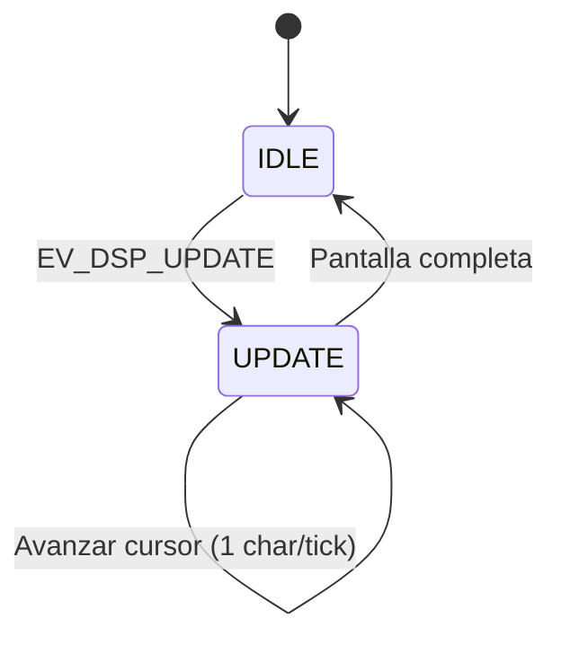
</div>
Figura 3.11: Máquina de estados para actualización no bloqueante del LCD.

Para lograr esto de forma segura, la tarea memoriza la fila y columna actuales, y en cada iteración del bucle principal (`app_update()`) procesa y transfiere vía I2C únicamente un carácter a la vez:

Código 3.3: Máquina de estados de transferencia del LCD.
```c
		case ST_DSP_UPDATE:
			if (COLUMNS > p_task_display_dta->column) {
				p_task_display_dta->character = 
                    p_task_display_dta->ddram[p_task_display_dta->row][p_task_display_dta->column++];
				displayDataWrite(p_task_display_dta->character);
			}
			else {
				p_task_display_dta->row++;
				if (ROWS > p_task_display_dta->row) {
					p_task_display_dta->column = 0;
					displayCharPositionWrite(p_task_display_dta->column, p_task_display_dta->row);
				}
				else {
					p_task_display_dta->state = ST_DSP_IDLE;
				}
			}
			break;
```

Los textos enviados a la DDRAM desde otras tareas siempre se completan o recortan a dieciséis caracteres para impedir residuos de mensajes anteriores y mantener una presentación estable sin requerir borrados explícitos.

### 3.3.8 Alarmas

La tarea de actuación recibe tres tipos de evento: apagar alarmas, advertencia de pulso y alarma crítica de SpO₂. Cada estado mantiene su propio temporizador y conmuta los indicadores sin detener el ejecutor cíclico.

La advertencia utiliza períodos de 500 ms y la alarma crítica, de 200 ms. En ambos casos el buzzer se activa mediante PWM con TIM3.

### 3.3.9 Telemetría

La tarea de telemetría mantiene una recepción UART por interrupción, un byte por vez. Los caracteres se acumulan hasta recibir retorno de carro o salto de línea. La transmisión se realiza mediante DMA para reducir la ocupación del procesador mientras se envía la trama.

Las mediciones se transmiten en formato JSON. Los comandos de configuración admitidos permiten modificar el mínimo de SpO₂, los límites de pulso y la habilitación conjunta de alarmas. Después de una modificación válida se solicita el guardado en EEPROM.

### 3.3.10 Medición temporal y bajo consumo

Para poder perfilar el rendimiento del firmware de forma precisa, se instrumentó el despachador de tareas (`app_update()`) utilizando el contador de ciclos de reloj del núcleo Cortex-M3 (`DWT->CYCCNT`).

Durante el bucle principal, antes de ejecutar cada tarea registrada, se reinicia el contador. Al retornar de la tarea, se lee el tiempo transcurrido en microsegundos y se actualiza de forma automática el peor tiempo de ejecución histórico (WCET) de esa tarea en particular, tal como se muestra en el Código 3.1:

Código 3.4: Instrumentación del planificador principal para medición dinámica del WCET.
```c
		/* Recorrer el arreglo de tareas */
		for (index = 0; TASK_QTY > index; index++) {
			cycle_counter_reset();

			if (NULL != task_cfg_list[index].task_update) {
				(*task_cfg_list[index].task_update)(task_cfg_list[index].parameters);
			}

			/* Calcular tiempo de la última ejecución (LET) */
			task_dta_list[index].LET = cycle_counter_get_time_us();

			/* Actualizar el mejor (BCET) y el peor caso (WCET) histórico */
			if (task_dta_list[index].BCET > task_dta_list[index].LET) {
				task_dta_list[index].BCET = task_dta_list[index].LET;
			}
			if (task_dta_list[index].WCET < task_dta_list[index].LET) {
				task_dta_list[index].WCET = task_dta_list[index].LET;
			}
		}
```

Estos valores se guardan en la estructura global `task_dta_list`, permitiendo inspeccionarlos en tiempo real con un depurador (Live Watch) para certificar que el firmware cumple con su límite estricto de 1 milisegundo por tick.

Adicionalmente, cuando el planificador detecta que ya no quedan eventos o ticks pendientes por procesar, el sistema entra en un estado de letargo mediante la instrucción en ensamblador `__WFI()` (Wait For Interrupt). Esta instrucción detiene el reloj principal del núcleo de procesamiento hasta la llegada de la próxima interrupción, manteniendo vivos únicamente a los periféricos esenciales, lo que reduce dramáticamente el consumo energético del dispositivo.

### 3.3.11 Máquina de estados principal (FSM)

El comportamiento general del sistema se rige por una máquina de estados finitos que asegura un monitoreo seguro y una respuesta a fallas de hardware. Los estados principales son `INICIALIZACIÓN`, `NORMAL`, `SET_UP`, `ALARMA_MÉDICA` y `FALLA`, lo cual se ilustra en la figura 3.12.

<div align="center">

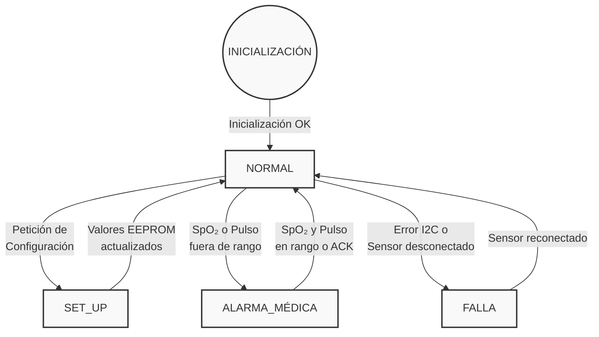

</div>
Figura 3.12: Diagrama de estados (FSM) general del firmware.

---

# CAPÍTULO 4: Ensayos y resultados

## 4.1 Pruebas funcionales y de integración
Se validó la interacción completa del sistema sin protoboards, verificando las respuestas de alarma, la visualización de datos de oxigenometría y el funcionamiento de la aplicación por Bluetooth.

Video Demostrativo del Trabajo Final:  
[Ver Video de Prueba de Integración](https://youtu.be/5kPUVFdzS14)

## 4.2 Análisis de memoria
A continuación, se detalla el uso de recursos tras la compilación final reportado por STM32CubeIDE, el cual se ilustra en la figura 4.1 y la figura 4.2.

<div align="center">
  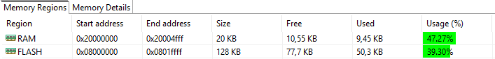
  <br>
  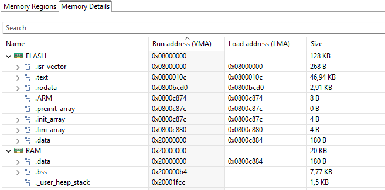
</div>
Figura 4.1: Reporte del Build Analyzer (Regiones de memoria).
Figura 4.2: Reporte del Build Analyzer (Detalles de secciones).

* Secciones principales:
  * .text (Código ejecutable): 46,94 KB
  * .rodata (Constantes): 2,91 KB
  * .data (Variables inicializadas): 180 B
  * .bss (Variables no inicializadas): 7,77 KB
  * ._user_heap_stack (Reserva Heap/Stack): 1,5 KB
* Regiones:
  * FLASH: 50,3 KB (39,30 %)
  * RAM: 9,45 KB (47,27 %)

## 4.3 Medición y análisis de tiempos (WCET)
El análisis de tiempos de ejecución se efectuó de forma dinámica instrumentando el propio planificador del firmware con el contador de ciclos del procesador (`DWT->CYCCNT`), tal y como se detalló en el apartado de diseño de software (Sección 3.3.10). Esto permitió registrar el peor caso (WCET) histórico que tomó cada tarea durante todo el periodo de ensayos.

**Tabla 4.1:** Peores tiempos de ejecución (WCET) medidos para cada tarea.

| Tarea | WCET [µs] | Observaciones de peor caso |
| :--- | :---: | :--- |
| task_sensor_update() | 18 | Lectura FIFO completa del MAX30102 (vía I2C). |
| task_system_update() | 258 | Salto a ALARMA_MÉDICA y actualización de EEPROM. |
| task_display_update() | 343 | Envío de un carácter completo vía I2C. |
| task_actuator_update() | 10 | Conmutación de LEDs y temporizadores de buzzer. |
| task_telemetry_update() | 96 | Armado del string JSON y ruteo a DMA. |

Conclusión parcial: La sumatoria máxima cumple holgadamente la condición menor a 1000 µs exigida para el super-loop.

## 4.4 Cálculo del factor de uso de CPU (U)
Sabiendo que $U = \sum (\text{WCET}_i / T_i)$ y que el período $T$ del ejecutor cíclico para todas las tareas es de 1000 µs (1 ms):

* Usensor = 18 µs / 1000 µs = 0,018 (1,8 %)
* Usystem = 258 µs / 1000 µs = 0,258 (25,8 %)
* Udisplay = 343 µs / 1000 µs = 0,343 (34,3 %)
* Uactuator = 10 µs / 1000 µs = 0,010 (1,0 %)
* Utelemetry = 96 µs / 1000 µs = 0,096 (9,6 %)

Factor de Uso Total (U): 72,5 %

## 4.5 Medición y análisis de consumo
Para evaluar el consumo energético del prototipo se utilizó un multímetro digital PRO'SKIT MT-1232 conectado en serie con cada linea de alimentación. Se midio la corriente en los rieles de 5 V y 3,3 V de forma separada tanto para el funcionamiento en modo de operación normal como en la condición de bajo consumo, y osciloscopio para detectar los picos de las transmisiones.

La potencia eléctrica se estimó a partir de los valores nominales de tensión y la corriente máxima observada, mediante la siguiente expresión:

$$
P = V \cdot I
$$

donde $P$ es la potencia, $V$ es la tensión del riel e $I$ es la corriente medida.

**Tabla 4.2:** Consumo energético medido para los rieles de 5 V y 3,3 V.

| Estado | Riel | Corriente Pico | Potencia | Observaciones |
| :--- | :---: | :---: | :---: | :--- |
| Normal | 5 V | 61,2 mA | 306 mW | BT + LCD activo. |
| Normal | 3,3 V | 16,60 mA | 54,78 mW | Procesamiento y lectura sensor I2C. |
| Bajo Consumo | 5 V | 50,5 mA | 252,5 mW | Modo sleep (LCD off / BT low power). |
| Bajo Consumo | 3,3 V| 14,74 mA | 48,64 mW | Sistema en estado WFI. |

Los resultados muestran una reducción del consumo al operar en modo bajo consumo. En el riel de 5 V, la corriente disminuyó de 61,2 mA a 50,5 mA, lo que representa una reducción aproximada del 17,5 %. En el riel de 3,3 V, la corriente disminuyó de 16,60 mA a 14,74 mA, equivalente a una reducción aproximada del 11,2 %.

Los valores de potencia informados son estimaciones calculadas a partir de la tensión nominal de cada riel. Las mediciones de ambos rieles se realizaron por separado, por lo que no deben sumarse automáticamente sin considerar el circuito de alimentación y la procedencia de cada tensión.

---

# CAPÍTULO 5: Conclusiones

El desarrollo de este Trabajo Final permitió validar exitosamente la integración de un sistema embebido de tiempo real estricto para el monitoreo de constantes vitales. El diseño basado en una arquitectura *super-loop* no bloqueante, disparada por eventos, demostró ser altamente eficiente; garantizando el cumplimiento de los plazos de ejecución (deadlines) rigurosos, dado que la totalidad de las tareas demandó un factor de uso máximo de CPU del 72,5 % frente al límite del *tick* de 1 milisegundo.

Desde el punto de vista del hardware, la comunicación I2C por interrupciones con el sensor MAX30102 y la transmisión asíncrona de telemetría a través de UART y Bluetooth aseguraron un flujo de datos robusto sin penalizar el rendimiento del núcleo. Asimismo, el diseño de la máquina de estados del actuador visual (LCD), gestionando la actualización de la pantalla carácter a carácter, probó ser una estrategia clave para sortear los retardos inherentes a los periféricos lentos.

En relación a la eficiencia de los recursos, el análisis de memoria evidenció un firmware sumamente optimizado que ocupa apenas un ~39 % de la memoria FLASH y un ~47 % de la memoria RAM disponible en el STM32F103RB. Además, la inserción de la instrucción de letargo (`__WFI()`) en los tiempos ociosos del planificador logró una reducción mensurable en el consumo energético, lo cual representa una cualidad indispensable para los dispositivos portátiles modernos.

A futuro, esta plataforma modular sienta una base escalable. La prolija separación en capas y el uso de un diccionario de datos centralizado habilitan múltiples vías de mejora, tales como el diseño de filtros digitales avanzados (IIR/FIR) para mayor inmunidad al ruido, o el desarrollo de un *dashboard* interactivo para smartphones (IoT) aprovechando que las tramas se serializan nativamente en formato JSON.

---

# Capítulo 6: Uso de herramientas de IA

Durante el desarrollo se utilizaron herramientas de inteligencia artificial generativa como apoyo para organizar documentación, revisar redacción técnica, interpretar fragmentos de código, proponer estructuras iniciales y detectar aspectos que requerían verificación.

El material generado mediante estas herramientas fue revisado y adaptado por los integrantes. Las decisiones de diseño, la integración del hardware, la ejecución de pruebas y la aceptación de los resultados permanecieron bajo responsabilidad del equipo.

Entre los usos realizados se incluyen:

- Elaboración y reorganización de secciones de la memoria técnica.
- Revisión de claridad, ortografía y consistencia terminológica.
- Explicación de módulos del firmware y relaciones entre tareas, drivers y eventos.
- Apoyo para documentar conexiones, interfaces y procedimientos de prueba.
- Identificación preliminar de posibles condiciones bloqueantes y recursos compartidos.

### Detalles de uso e implementación

- **Herramienta utilizada:** Antigravity (asistente de IA generativa impulsado por los modelos Gemini de Google DeepMind).
- **Ejemplos concretos de asistencia:**
  - Asistencia en la estructuración y redacción técnica de los apartados de diseño de hardware y software (Capítulo 3).
  - Generación de diagramas de estado para ilustrar la lógica del menú interactivo y la máquina de estados del LCD.
  - Validación matemática del factor de uso de CPU (U) a partir de las mediciones empíricas de los peores tiempos de ejecución (WCET).
  - Formateo profesional, corrección de estilo y estandarización del documento Markdown.
- **Criterio de verificación:** Todo el contenido, los diagramas y los textos sugeridos por la herramienta fueron auditados exhaustivamente contra el código fuente real del proyecto. Los cálculos matemáticos y métricas de memoria fueron validados comparándolos con las mediciones empíricas y los reportes de compilación de STM32CubeIDE, garantizando así la absoluta veracidad técnica del informe final.

---

# Bibliografía

\[1\] Beuchat, R., Depraz, F., Guerrieri, A., & Kashani, S. (2021). *Fundamentals of system-on-chip design on Arm Cortex-M microcontrollers*. Arm Education Media.

\[2\] Maxim Integrated (2016). *MAXREFDES117# Heart-Rate and Pulse-Oximetry Monitor*. Algoritmo base adaptado para estimación de SpO₂ y frecuencia cardíaca, ampliamente distribuido por SparkFun Electronics. Extraído del código fuente original `spo2_algorithm.c` y `spo2_algorithm.h`.

\[3\] ARM / Keil. *STMicroelectronics NUCLEO-F103RB Board Guide*. Disponible en: [https://www.keil.arm.com/boards/stmicroelectronics-nucleo-f103rb-revc-733985f/guide/](https://www.keil.arm.com/boards/stmicroelectronics-nucleo-f103rb-revc-733985f/guide/)

\[4\] STMicroelectronics. *RM0008 Reference manual: STM32F101xx, STM32F102xx, STM32F103xx, STM32F105xx and STM32F107xx advanced Arm-based 32-bit MCUs*. Disponible en: [https://www.st.com/resource/en/reference_manual/rm0008-stm32f101xx-stm32f102xx-stm32f103xx-stm32f105xx-and-stm32f107xx-advanced-armbased-32bit-mcus-stmicroelectronics.pdf](https://www.st.com/resource/en/reference_manual/rm0008-stm32f101xx-stm32f102xx-stm32f103xx-stm32f105xx-and-stm32f107xx-advanced-armbased-32bit-mcus-stmicroelectronics.pdf)

\[5\] STMicroelectronics. *STM32F103x8, STM32F103xB Datasheet*. Disponible en: [https://www.st.com/resource/en/datasheet/stm32f103cb.pdf](https://www.st.com/resource/en/datasheet/stm32f103cb.pdf)