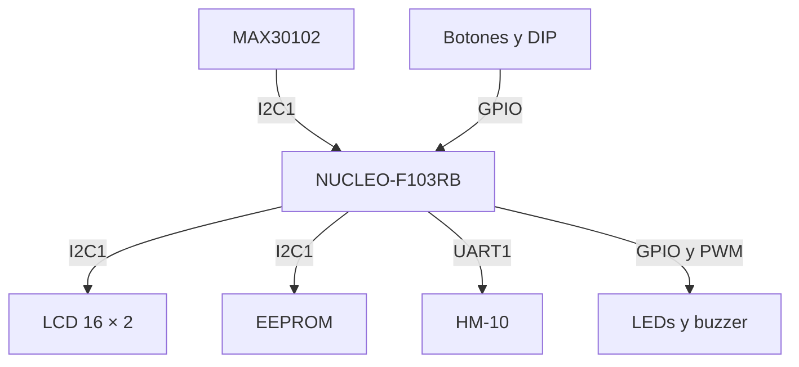
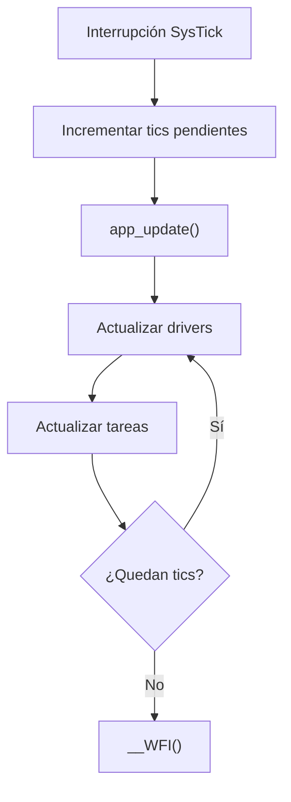

<div align="center">


**UNIVERSIDAD DE BUENOS AIRES**  
**Facultad de Ingeniería**  
**TA134 – Taller de Sistemas Embebidos**  

Memoria del Trabajo Final:

# Monitor Multiparamétrico de Signos Vitales (MMSV)

**Autores:**<br>
BONACORSI, Lautaro Quimey — Legajo: 110115<br>
BONFIGLIO, Guido Martin — Legajo: 104884<br>
TALARICO, Jonatan Axel — Legajo: 89396<br>

Este trabajo fue realizado en la Ciudad Autónoma de Buenos Aires,
entre marzo y julio de 2026.
</div>

---

# RESUMEN

En el presente trabajo se diseñó e implementó un monitor de signos vitales portátil orientado al seguimiento de pacientes en tiempo real. El dispositivo, bautizado como Monitor Multiparamétrico de Signos Vitales (MMSV), es capaz de medir de manera continua la saturación periférica de oxígeno en sangre (SpO₂) y la frecuencia cardíaca mediante el sensor óptico MAX30102.

Para alertar sobre situaciones críticas de hipoxia o desconexiones, cuenta con un sistema de alarmas médicas configurables, tanto visuales como sonoras, así como con visualización local en un display LCD de 16x2. Además, integra un módulo Bluetooth (HM-10) que transmite de forma ininterrumpida la telemetría a una aplicación móvil, lo cual permite la centralización de datos a distancia.

El desarrollo se llevó a cabo sobre una placa NUCLEO-F103RB, programada bajo una arquitectura Bare Metal guiada por eventos (Event-Triggered System). Su estructura se centra en un super-loop no bloqueante menor a 1 ms, garantizando una alta responsividad y sentando las bases de diseño para dispositivos biomédicos confiables.

---

# Registro de versiones

| Revisión | Cambios realizados | Fecha |
| :---: | --- | :---: |
| 1.0 | Creación del documento | 10/07/2026 |

*Tabla 0.1 - Registro de versiones del documento*

---

# Índice General

- [Registro de versiones](#registro-de-versiones)
- [Capítulo 1: Introducción general](#capítulo-1-introducción-general)
  - [1.1 Análisis de necesidad](#11-análisis-de-necesidad)
  - [1.2 Objetivo del proyecto](#12-objetivo-del-proyecto)
  - [1.3 Objetivos específicos](#13-objetivos-específicos)
  - [1.4 Alcance y limitaciones](#14-alcance-y-limitaciones)
- [Capítulo 2: Introducción específica](#capítulo-2-introducción-específica)
  - [2.1 Requisitos](#21-requisitos)
  - [2.2 Casos de uso](#22-casos-de-uso)
- [Capítulo 3: Diseño e implementación](#capítulo-3-diseño-e-implementación)
  - [3.1 Arquitectura general](#31-arquitectura-general)
  - [3.2 Diseño de hardware](#32-diseño-de-hardware)
  - [3.3 Diseño de software](#33-diseño-de-software)
- [Capítulo 4: Ensayos y resultados](#capítulo-4-ensayos-y-resultados)
  - [4.1 Pruebas funcionales y de integración](#41-pruebas-funcionales-y-de-integración)
  - [4.2 Análisis de memoria](#42-análisis-de-memoria)
  - [4.3 Medición y análisis de tiempos (WCET)](#43-medición-y-análisis-de-tiempos-wcet)
  - [4.4 Cálculo del factor de uso de CPU (U)](#44-cálculo-del-factor-de-uso-de-cpu-u)
  - [4.5 Medición y análisis de consumo](#45-medición-y-análisis-de-consumo)
- [Capítulo 5: Conclusiones](#capítulo-5-conclusiones)
- [Capítulo 6: Uso de herramientas de IA](#capítulo-6-uso-de-herramientas-de-ia)
- [Bibliografía](#bibliografía)

---

# CAPÍTULO 1: Introducción general

## 1.1 Análisis de necesidad

La medición de signos vitales permite obtener información básica sobre el estado de salud de una persona y detectar situaciones que requieren observación. Entre estos parámetros, la saturación periférica de oxígeno y la frecuencia cardíaca pueden adquirirse de forma no invasiva mediante técnicas de fotopletismografía.

Los oxímetros de pulso comerciales integran el sensor, el procesamiento y la presentación de los resultados en un único instrumento. Sin embargo, suelen comportarse como equipos cerrados, con posibilidades limitadas de configuración, almacenamiento o integración con otros sistemas. En el ámbito educativo, el desarrollo de un prototipo propio permite estudiar en conjunto la adquisición de señales biomédicas, el procesamiento digital, las interfaces de usuario, las comunicaciones y el cumplimiento de restricciones temporales.

El MMSV fue planteado como un prototipo portátil capaz de medir SpO₂ y frecuencia cardíaca, mostrar los resultados localmente y transmitirlos de manera inalámbrica. Además, se buscó incorporar umbrales configurables y distintos perfiles de usuario, de modo de generar alarmas visuales y sonoras cuando los valores calculados se encuentren fuera de los límites establecidos.

## 1.2 Objetivo del proyecto
El objetivo de este proyecto es diseñar e implementar un monitor de signos vitales portátil orientado al seguimiento de pacientes en tiempo real. Mide saturación de oxígeno en sangre (SpO₂) y frecuencia cardíaca mediante el sensor MAX30102. Cuenta con un sistema de alarmas médicas configurables, visualización local en display LCD 16x2 y transmisión constante vía Bluetooth (HM-10) hacia una app móvil.

## 1.3 Objetivos específicos

Los objetivos específicos del trabajo son:

- Integrar el sensor MAX30102 con la placa NUCLEO-F103RB mediante I2C.
- Procesar las muestras roja e infrarroja para estimar SpO₂ y frecuencia cardíaca.
- Incorporar un display LCD 16 × 2 para presentar mediciones, menús y mensajes de estado.
- Implementar una interfaz local de cuatro botones para recorrer menús y modificar parámetros.
- Seleccionar el perfil inicial mediante un DIP switch de cuatro posiciones.
- Almacenar los umbrales configurados en una memoria EEPROM externa.
- Generar alarmas diferenciadas mediante LED rojo, LED amarillo y buzzer controlado por PWM.
- Transmitir telemetría y recibir comandos de configuración mediante un módulo HM-10.
- Organizar el firmware en tareas cooperativas y máquinas de estados, sin utilizar un sistema operativo.
- Evaluar experimentalmente la utilización de memoria, los tiempos de ejecución y el consumo del prototipo.

## 1.4 Alcance y limitaciones

El alcance del proyecto comprende el desarrollo de un prototipo académico funcional sobre una placa NUCLEO-F103RB y módulos comerciales. El sistema incluye adquisición, procesamiento, visualización, configuración, persistencia, alarmas y telemetría.

Las estimaciones obtenidas dependen de la colocación del dedo, el movimiento, la iluminación externa, las características del módulo sensor y el algoritmo utilizado. Por ese motivo, los resultados deben interpretarse únicamente dentro del alcance experimental del trabajo.

El MMSV no fue diseñado conforme a normas de seguridad eléctrica, compatibilidad electromagnética, biocompatibilidad o desempeño exigidas a dispositivos médicos. Tampoco fue calibrado ni validado clínicamente contra equipamiento certificado. Por lo tanto, no debe utilizarse para diagnóstico, tratamiento o monitoreo clínico real.

---

# CAPÍTULO 2: Introducción específica

## 2.1 Requisitos
A continuación, se listan los requisitos establecidos para el desarrollo (Hardware y Software obligatorio y adicional):

| Grupo | ID | Descripción |
| :---- | :---- | :---- |
| **Hardware Obligatorio** | 1.1 | Se utiliza un DIP Switch de 4 posiciones para seleccionar el perfil de paciente inicial. |
| | 1.2 | Botones (4) para interacción con el menú local y Acknowledge (silenciador de alarmas). |
| | 1.3 | Indicadores LED (amarillo/rojo) y Buzzer PWM para alarmas críticas. |
| | 1.4 | Módulo HM-10 (UART) para telemetría Bluetooth constante. |
| | 1.5 | Memoria EEPROM I2C para almacenamiento del SET_UP y eventos. |
| | 1.6 | El sistema no usa protoboards ni cables Dupont. Todo está interconectado mediante placa base y conectores/cables soldados. |
| **Hardware Adicional** | 2.1 | Sensor analógico biométrico MAX30102 (I2C + INT). |
| | 2.2 | Display LCD 16x2 I2C para visualización fluida de menú interactivo. |
| | 2.3 | Adaptador de niveles lógicos TXB0108 (3.3V a 5V) para display. |
| **Software Obligatorio** | 3.1 | Arquitectura Bare Metal, Event-Triggered System con Super-Loop < 1mS. |
| | 3.2 | Base de tiempo SysTick de 1ms; tareas no bloqueantes e implementación de rutinas Sleep/Bajo Consumo. |
| **Software Adicional** | 4.1 | Gestión concurrente y asincrónica del bus I2C (EXTI para MAX30102). |

*Tabla 2.1: Requisitos obligatorios y adicionales*

## 2.2 Casos de uso

En esta sección se describen las principales situaciones de operación previstas para el Monitor Multiparamétrico de Signos Vitales, desde la inicialización hasta la medición, configuración y transmisión de los datos.

### 2.2.1 Inicio y selección de perfil

| Elemento | Definición |
| --- | --- |
| **Disparador** | Encendido o reinicio del equipo. |
| **Precondiciones** | Hardware correctamente conectado y DIP switch configurado. |
| **Flujo básico** | 1. El firmware inicializa el microcontrolador y los periféricos.<br>2. Se lee la combinación seleccionada en el DIP switch.<br>3. Se identifica el perfil de paciente correspondiente.<br>4. Se recuperan desde la EEPROM los umbrales asociados al perfil.<br>5. Si no existe una configuración válida, se cargan los valores predeterminados y se solicita su almacenamiento.<br>6. El display presenta la pantalla de operación normal. |
| **Alternativas** | Si la combinación del DIP switch no corresponde a un perfil válido, el sistema queda bloqueado y solicita corregir la selección y reiniciar. La combinación reservada para el restablecimiento de fábrica borra las configuraciones almacenadas. |

*Tabla 2.2 - Caso de uso: inicio y selección de perfil.*

### 2.2.2 Medición de SpO₂ y frecuencia cardíaca

| Elemento | Definición |
| --- | --- |
| **Disparador** | El MAX30102 indica mediante su señal `INT` que existe una nueva muestra disponible. |
| **Precondiciones** | Sensor inicializado, comunicación I2C disponible y dedo colocado correctamente. |
| **Flujo básico** | 1. El firmware detecta la activación de la señal `INT` del MAX30102.<br>2. Se leen del FIFO las muestras correspondientes a los canales rojo e infrarrojo.<br>3. Las muestras se incorporan a la ventana de procesamiento.<br>4. Cuando se reúne una cantidad suficiente de muestras, se calculan la saturación de oxígeno y la frecuencia cardíaca.<br>5. Los valores válidos se presentan en el display.<br>6. Las mediciones se envían a la tarea de telemetría para su transmisión por Bluetooth. |
| **Alternativas** | Si la señal infrarroja no supera el nivel utilizado para detectar la presencia del dedo, se invalidan las mediciones, se informa la ausencia de dedo en el display y se transmite el mensaje de error correspondiente. |

*Tabla 2.3 - Caso de uso: medición de signos vitales.*

### 2.2.3 Detección y alerta de valores fuera de rango

| Elemento | Definición |
| --- | --- |
| **Disparador** | Recepción de una nueva medición válida de SpO₂ o frecuencia cardíaca. |
| **Precondiciones** | Perfil cargado, umbrales configurados y alarmas habilitadas. |
| **Flujo básico** | 1. La tarea de sistema recibe una nueva medición.<br>2. Se comparan los valores calculados con los límites mínimo y máximo configurados.<br>3. Si el valor de SpO₂ se encuentra fuera del rango permitido, se genera un evento de alarma crítica.<br>4. La tarea de actuación activa el LED rojo y un patrón rápido de buzzer.<br>5. Si la frecuencia cardíaca está fuera de rango, se genera una advertencia mediante el LED y un patrón más lento de buzzer.<br>6. El estado de alarma se incorpora a la trama de telemetría. |
| **Alternativas** | Si ambas mediciones se encuentran dentro de sus respectivos rangos, se genera un evento de desactivación y se apagan los LEDs y el buzzer. Si coinciden una alarma de SpO₂ y una advertencia de pulso, se prioriza la alarma crítica de SpO₂. |

*Tabla 2.4 - Caso de uso: detección y alerta de valores fuera de rango.*

### 2.2.4 Configuración local de umbrales

| Elemento | Definición |
| --- | --- |
| **Disparador** | Pulsación del botón `MENU` durante la operación normal. |
| **Precondiciones** | Sistema inicializado, perfil válido seleccionado y equipo no bloqueado. |
| **Flujo básico** | 1. El sistema ingresa al modo de configuración `SETUP`.<br>2. El usuario selecciona entre oxímetro y pulsómetro.<br>3. Se elige el parámetro que se desea modificar: límite mínimo, límite máximo o habilitación de la alarma.<br>4. El valor seleccionado se modifica mediante los botones de control.<br>5. El display presenta los cambios realizados.<br>6. Al abandonar el menú, la configuración se compara con la última versión almacenada.<br>7. Si existen modificaciones, los nuevos valores se guardan en la EEPROM del perfil activo.<br>8. El sistema regresa al modo de operación normal. |
| **Alternativas** | El usuario puede regresar al nivel anterior del menú. Si no se modificó ningún parámetro, no se realiza una nueva escritura en la EEPROM. |

*Tabla 2.5 - Caso de uso: configuración local de umbrales.*

### 2.2.5 Telemetría y configuración remota

| Elemento | Definición |
| --- | --- |
| **Disparador** | Disponibilidad de una nueva medición o recepción de un comando mediante USART1. |
| **Precondiciones** | Módulo HM-10 conectado y enlace Bluetooth establecido con un dispositivo externo. |
| **Flujo básico** | 1. La tarea de telemetría recibe un evento de nueva medición.<br>2. Se construye una trama de texto en formato JSON con SpO₂, frecuencia cardíaca y estado de alarma.<br>3. La trama se transmite mediante USART1 utilizando DMA.<br>4. Paralelamente, la recepción UART permanece activa por interrupciones.<br>5. Si se recibe un comando válido, se identifica el parámetro y su nuevo valor.<br>6. Se actualiza la configuración correspondiente.<br>7. Los cambios se solicitan guardar en la EEPROM. |
| **Alternativas** | Ante la ausencia de dedo se transmite un mensaje de error. Los comandos desconocidos, incompletos o con formato inválido se descartan sin modificar la configuración. |

*Tabla 2.6 - Caso de uso: telemetría y configuración remota.*

### 2.2.6 Falla o desconexión del sensor

| Elemento | Definición |
| --- | --- |
| **Disparador** | Error de comunicación I2C, respuesta NACK o desconexión del MAX30102. |
| **Precondiciones** | Sistema inicializado y sensor previamente conectado. |
| **Flujo previsto** | 1. El driver detecta el error durante una operación I2C.<br>2. Se interrumpe la adquisición de nuevas muestras.<br>3. Se genera un evento de falla técnica.<br>4. El display informa el error del sensor.<br>5. El LED y el buzzer generan un patrón de advertencia.<br>6. El sistema permanece en condición de falla o intenta recuperar la comunicación, según la estrategia definida. |
| **Estado actual** | La recuperación completa ante la desconexión del MAX30102 y el estado específico de falla todavía no están implementados en el firmware analizado. Este caso de uso queda planteado como una funcionalidad pendiente. |

*Tabla 2.7 - Caso de uso previsto: falla o desconexión del sensor.*


<!--
En esta sección se detallan las situaciones de operación previstas para el Monitor Multiparamétrico.

Tabla 2.2: Caso de uso 1 - Detección y alerta de Hipoxia
| Elemento | Definición |
| --- | --- |
| **Disparador** | El sistema calcula que el SpO₂ está por debajo del límite seguro guardado. |
| **Flujo básico** | 1. Sensor informa valor bajo.<br>2. Super-Loop detecta anomalía.<br>3. Transición al estado ALARMA_MEDICA.<br>4. Buzzer y LED Rojo se activan (no bloqueante).<br>5. Se envía trama ALERTA_CRITICA por Bluetooth. |
| **Alternativas** | Si un enfermero pulsa Acknowledge, se silencia la alarma temporalmente. Si el valor se recupera, el sistema retorna al estado NORMAL automáticamente. |


Tabla 2.3: Caso de uso 2 - Configuración de local umbrales
| Elemento | Definición |
| --- | --- |
| **Disparador** | Modificación de los límites de alarma del equipo (vía App o local). |
| **Flujo básico** | 1. Se recibe comando por UART o botón ingresando al estado SET_UP.<br>2. Se actualizan variables de límite.<br>3. Se graban los nuevos límites en EEPROM vía I2C.<br>4. Se confirma en LCD y retorna a NORMAL. |


Tabla 2.4: Caso de uso 3 - Falla por desconexión
| Elemento | Definición |
| --- | --- |
| **Disparador** | Desconexión abrupta del sensor MAX30102. |
| **Flujo básico** | 1. Rutina de I2C detecta Timeout/NACK.<br>2. Aborto de muestreo y salto a estado FALLA.<br>3. Display muestra "ERR: SENSOR".<br>4. LED amarillo y pitido lento indican alarma técnica (requiere reinicio). |


Tabla 2.5: Caso de uso 4 - Inicio y selección de perfil
| Elemento | Definición |
| --- | --- |
| Disparador | Encendido o reinicio del equipo. |
| Precondiciones | Hardware conectado y un perfil válido seleccionado en el DIP switch. |
| Flujo básico | El firmware inicializa los periféricos, interpreta el DIP switch, identifica el perfil y recupera sus umbrales desde la EEPROM. Si no existe una configuración válida, carga valores predeterminados y los guarda. Finalmente presenta la pantalla de operación normal. |
| Alternativas | Si la combinación del DIP switch no representa un perfil válido, el sistema queda bloqueado y solicita corregir la selección y reiniciar. La combinación reservada permite borrar las configuraciones almacenadas. |


Tabla 2.6: Caso de uso 5 - Medición de signos vitales.
| Elemento | Definición |
| --- | --- |
| Disparador | El MAX30102 indica que hay una nueva muestra disponible. |
| Precondiciones | Sensor inicializado y dedo colocado correctamente. |
| Flujo básico | Se leen las muestras roja e infrarroja del FIFO, se incorporan al bloque de procesamiento y, cuando existe una ventana suficiente, se calculan SpO₂ y frecuencia cardíaca. Los valores válidos se actualizan en el display y se envían a telemetría. |
| Alternativas | Si la señal infrarroja no supera el nivel utilizado para detectar el dedo, se invalidan las mediciones y se informa que no hay dedo colocado. |


Tabla 2.7: Caso de uso 6 - Detección y señalización de valores fuera de rango.
| Elemento | Definición |
| --- | --- |
| Disparador | Recepción de una nueva medición válida. |
| Precondiciones | Alarma correspondiente habilitada y umbrales cargados. |
| Flujo básico | La tarea de sistema compara las mediciones con los límites del perfil. Un valor de SpO₂ fuera de rango genera la alarma crítica, indicada mediante LED rojo y un patrón rápido de buzzer. Un valor de pulso fuera de rango genera una advertencia mediante LED amarillo y un patrón más lento. |
| Alternativas | Cuando ambas mediciones regresan a sus rangos admitidos, se desactivan los indicadores y el buzzer. |


Tabla 2.7: Caso de uso 6 - Configuración local de umbrales.
--->

## 2.3 Descripción de módulos principales

### 2.3.1 Placa NUCLEO-F103RB

La NUCLEO-F103RB constituye la unidad de procesamiento y control. Integra un microcontrolador STM32F103RB con núcleo ARM Cortex-M3, memoria Flash, SRAM y periféricos como GPIO, temporizadores, I2C, UART y DMA. En el proyecto ejecuta el algoritmo de procesamiento y coordina los demás módulos.

El reloj del sistema se obtiene a partir del oscilador interno HSI y del PLL. De acuerdo con la configuración de `SystemClock_Config()`, el núcleo funciona a 64 MHz. El SysTick proporciona la base temporal de 1 ms utilizada por el ejecutor cíclico.

### 2.3.2 Sensor MAX30102

El MAX30102 es un sensor óptico integrado para aplicaciones de oximetría y medición de pulso. Incorpora LED rojo, LED infrarrojo, fotodetector, conversión analógica-digital y un FIFO interno. Se comunica mediante I2C y dispone de una salida `INT` activa en nivel bajo.

El firmware configura el sensor en modo SpO₂, con adquisición de los dos canales ópticos. Cada muestra está compuesta por 18 bits útiles para el canal rojo y 18 bits para el infrarrojo. Las muestras se entregan al algoritmo encargado de formar la ventana de procesamiento y calcular los parámetros fisiológicos.

### 2.3.3 Display LCD 16 × 2

El display presenta las mediciones, los menús de configuración y los mensajes de error. Se utiliza junto con una interfaz basada en PCF8574, que permite controlar el LCD mediante I2C y reducir la cantidad de pines requeridos.

La tarea de display conserva una representación local de sus dos líneas y transfiere los caracteres progresivamente. Esta estrategia distribuye la actualización en sucesivos ciclos del programa y evita reescribir continuamente toda la pantalla desde la lógica del sistema.

### 2.3.4 Memoria EEPROM

La EEPROM externa almacena la configuración persistente de los perfiles. Cada registro contiene una palabra de validación, los límites mínimo y máximo de SpO₂ y pulso, y el estado de habilitación de las alarmas.

Las configuraciones de los perfiles se ubican en bloques separados. Si al iniciar no se encuentra la palabra de validación esperada, el firmware aplica valores predeterminados para el perfil y solicita su almacenamiento. Las escrituras normales se realizan por interrupción y el driver verifica posteriormente la finalización del ciclo interno de escritura.

### 2.3.5 Interfaz de botones y DIP switch

La interacción local se realiza mediante cuatro pulsadores: `MENU`, `UP`, `DOWN` y `ACK`. Cada botón cuenta con una máquina de estados de antirrebote que distingue los estados estable alto, flanco descendente, estable bajo y flanco ascendente. Una pulsación validada genera un evento para la tarea de sistema.

El DIP switch permite seleccionar uno de los perfiles disponibles al iniciar. También se utiliza una combinación reservada para el restablecimiento de fábrica. La selección se evalúa durante la inicialización; si no es válida, se presenta un mensaje y se bloquea la operación hasta el siguiente reinicio.

### 2.3.6 Indicadores y buzzer

El bloque de actuación está compuesto por dos LEDs y un buzzer controlado mediante el canal 1 del temporizador TIM3. El firmware utiliza patrones no bloqueantes basados en contadores de 1 ms.

La advertencia de pulso alterna el LED y el buzzer cada 500 ms. La alarma crítica de SpO₂ utiliza el LED y alterna el buzzer cada 200 ms. Al iniciarse el equipo se ejecuta un autodiagnóstico visual y sonoro para comprobar los actuadores.

### 2.3.7 Módulo Bluetooth HM-10

El HM-10 proporciona conectividad Bluetooth Low Energy mediante una interfaz UART transparente. Se conecta a USART1 y permite transmitir mediciones hacia un dispositivo externo y recibir comandos de configuración.

La telemetría se transmite como texto con estructura JSON. Un ejemplo de trama es:

```json
{"type":"data","SpO₂":97,"bpm":72,"alarm":0}
```

Los comandos recibidos utilizan un formato simple, compuesto por el prefijo `CFG`, el nombre del parámetro y su valor. Por ejemplo:

```text
CFG:SpO₂_MIN:92
CFG:BPM_MAX:110
CFG:ALARM:1
```

## 2.4 Comunicación I2C

### 2.4.1 Características del bus

I2C es un bus serie síncrono de dos líneas: `SCL`, utilizada como reloj, y `SDA`, utilizada para transferir datos. Ambas señales son de colector o drenador abierto y requieren resistencias *pull-up*. Un controlador inicia las transferencias y cada periférico responde a una dirección determinada.

En el MMSV, la NUCLEO-F103RB actúa como controlador del bus I2C1. Las señales se encuentran asignadas a `PB6` para `SCL` y `PB7` para `SDA`. El bus se configura a 100 kHz.

### 2.4.2 Dispositivos conectados

| Dispositivo | Función | Dirección utilizada | Tipo de acceso |
| --- | --- | :---: | --- |
| MAX30102 | Adquisición de muestras roja e infrarroja | `0x57` de 7 bits | Lectura y escritura de registros |
| EEPROM | Persistencia de configuraciones | Según módulo utilizado | Lectura y escritura de memoria |
| LCD con PCF8574 | Visualización local | `0x27` o `0x3F` de 7 bits | Escritura de comandos y datos |

*Tabla 2.8 - Dispositivos conectados al bus I2C1.*

Las direcciones indicadas son direcciones de 7 bits. La biblioteca HAL utiliza normalmente la dirección desplazada un bit a la izquierda al efectuar una transferencia.

### 2.4.3 Interconexión eléctrica

El MAX30102 y la EEPROM deben mantener niveles lógicos compatibles con los 3,3 V del STM32. El display se alimenta normalmente con 5 V para asegurar el contraste y la iluminación; por este motivo, se incorporó una etapa de adaptación de niveles entre el dominio del microcontrolador y el módulo LCD.

Todos los dispositivos comparten `SCL`, `SDA` y una referencia común de masa. Antes del montaje final se debe verificar la presencia de resistencias *pull-up* en los módulos, ya que la conexión en paralelo de varias redes de resistencias puede reducir excesivamente su valor equivalente.

### 2.4.4 Administración desde el firmware

El bus I2C es un recurso compartido. El MAX30102 y el LCD utilizan transferencias bloqueantes de corta duración, mientras que la EEPROM dispone de operaciones por interrupción para las escrituras habituales. La aplicación actualiza los drivers antes de ejecutar las tareas y cada módulo comprueba el estado del periférico antes de iniciar determinadas operaciones.

Esta organización debe considerarse al analizar el tiempo de ejecución: una transferencia extensa, una espera por disponibilidad del bus o un *timeout* forman parte del peor caso del ciclo. En una evolución del proyecto sería conveniente centralizar todas las solicitudes I2C en un único administrador no bloqueante, con una cola de transacciones y prioridades definidas.

---

# CAPÍTULO 3: Diseño e implementación

## 3.1 Arquitectura general

La arquitectura del MMSV se divide en cuatro bloques funcionales:

1. **Adquisición:** obtiene las muestras ópticas del MAX30102.
2. **Procesamiento y control:** calcula SpO₂ y pulso, administra los perfiles, compara umbrales y coordina los eventos.
3. **Interfaz y actuación:** comprende botones, DIP switch, LCD, LEDs y buzzer.
4. **Comunicación y persistencia:** incluye el HM-10 y la EEPROM.

La NUCLEO-F103RB ocupa el centro del sistema y se conecta con los periféricos mediante I2C, UART, GPIO y PWM.



## 3.2 Diseño de hardware

### 3.2.1 Criterio de montaje

La integración final se realiza sobre una placa base, evitando el uso de protoboard y cables Dupont. Los módulos se conectan mediante conductores soldados y conectores, con una masa común y distribución diferenciada de 3,3 V y 5 V.

La disposición debe permitir acceder al sensor con el dedo, observar el display y los indicadores, accionar los botones y modificar el DIP switch. También debe evitar esfuerzos mecánicos sobre los conectores y cortocircuitos entre ambas líneas de alimentación.

> **Pendiente:** incorporar una fotografía general del montaje y una imagen de la cara de soldaduras.

### 3.2.2 Alimentación y niveles lógicos

El STM32F103RB y el MAX30102 operan con señales de 3,3 V. El módulo LCD se alimenta con 5 V y se conecta al bus mediante adaptación bidireccional de niveles. El módulo HM-10 utilizado incorpora su propia placa de adaptación de alimentación, mientras que sus señales UART son compatibles con la lógica de 3,3 V del microcontrolador.

La masa debe ser común a todos los módulos. Antes de energizar se deben verificar continuidad, ausencia de cortocircuitos entre alimentación y masa y polaridad correcta de cada conector.

### 3.2.3 Entradas digitales

Los cuatro botones se conectan a `PC0`, `PC1`, `PC2` y `PC3`. El estado presionado corresponde a un nivel lógico alto, por lo que cada entrada requiere una resistencia *pull-down*. El DIP switch utiliza `PA0`, `PA1`, `PA4` y `PB0` con el mismo criterio eléctrico.

La salida `INT` del MAX30102 se conecta a `PB10`. Esta señal es activa en nivel bajo e informa la disponibilidad de una nueva muestra en el FIFO.

### 3.2.4 Salidas de alarma

Los LEDs se conectan a `PB1` y `PB2`, mediante resistencias limitadoras. El buzzer se controla desde `PA6`, correspondiente a `TIM3_CH1`.

Si el buzzer utilizado requiere una corriente superior a la admitida por un GPIO, debe interponerse una etapa de manejo con transistor y diodo de protección cuando corresponda. El GPIO debe utilizarse como señal de control y no como fuente directa de potencia.

### 3.2.5 Comunicaciones

El bus I2C1 utiliza `PB6` y `PB7` y conecta MAX30102, EEPROM y LCD. USART1 utiliza `PA9` y `PA10` para comunicarse con el HM-10. USART2 se encuentra vinculada al ST-LINK de la placa y se utiliza como consola de depuración a 115200 bit/s.

### 3.2.6 Pinout del sistema

| Componente | Pin STM32 | Función |
| --- | :---: | --- |
| Botón MENU | `PC0` | Entrada digital |
| Botón UP | `PC1` | Entrada digital |
| Botón DOWN | `PC2` | Entrada digital |
| Botón ACK | `PC3` | Entrada digital |
| DIP 1 | `PA0` | Selección de perfil |
| DIP 2 | `PA1` | Selección de perfil |
| DIP 3 | `PA4` | Selección de perfil |
| DIP 4 | `PB0` | Selección/restablecimiento |
| LED amarillo | `PB1` | Salida digital |
| LED rojo | `PB2` | Salida digital |
| Buzzer | `PA6` | `TIM3_CH1`, salida PWM |
| MAX30102 INT | `PB10` | Entrada digital activa baja |
| I2C1 SCL | `PB6` | Reloj I2C |
| I2C1 SDA | `PB7` | Datos I2C |
| HM-10 RX | `PA9` | `USART1_TX` |
| HM-10 TX | `PA10` | `USART1_RX` |

*Tabla 3.1 - Asignación de pines del MMSV.*

### 3.2.7 Esquemático y montaje final

> **Pendiente:** insertar el esquemático eléctrico definitivo.

> **Pendiente:** insertar fotografías del montaje y numerarlas como figuras del Capítulo 3.

## 3.3 Diseño de software

### 3.3.1 Organización del proyecto

El proyecto se generó mediante STM32CubeMX y se desarrolla en STM32CubeIDE. El código se divide en:

- `Core/`: inicialización del microcontrolador, periféricos, interrupciones y punto de entrada.
- `Drivers/`: CMSIS y biblioteca HAL suministradas por STMicroelectronics.
- `app/inc/`: interfaces, tipos y definiciones de la aplicación.
- `app/src/`: planificador, tareas, drivers propios y algoritmos.

Esta separación evita mezclar la lógica funcional con el código de inicialización generado automáticamente.

### 3.3.2 Ejecutor cíclico

Después de inicializar HAL, reloj y periféricos, `main()` llama a `app_init()`. A continuación ingresa en un bucle infinito que ejecuta `app_update()` y luego `__WFI()`.

El SysTick incrementa el contador global de tics cada 1 ms. `app_update()` consume los tics pendientes y, por cada uno, actualiza los drivers y las tareas registradas. Si durante una ejecución se acumula otro tic, el ciclo se repite hasta recuperar el atraso.



La lista de tareas contiene cinco entradas:

| Orden | Tarea | Responsabilidad principal |
| :---: | --- | --- |
| 1 | `task_sensor` | Lectura y antirrebote de botones |
| 2 | `task_system` | Menús, configuración, perfiles, umbrales y alarmas |
| 3 | `task_display` | Actualización progresiva del LCD |
| 4 | `task_actuator` | Patrones de LEDs y buzzer |
| 5 | `task_telemetry` | Transmisión y recepción mediante USART1 |

*Tabla 3.2 - Tareas ejecutadas por la aplicación.*

### 3.3.3 Comunicación por eventos

Las tareas se desacoplan mediante interfaces de eventos. Por ejemplo, la tarea de sensores no modifica directamente el menú: valida una pulsación y coloca un evento para la tarea de sistema. De igual modo, el algoritmo informa una medición nueva y la tarea de sistema decide qué presentar y qué alarma activar.

Este enfoque reduce dependencias entre módulos y permite que cada tarea conserve su propia máquina de estados. Las interfaces actuales almacenan eventos pendientes de forma acotada; por ello, el ritmo de producción de eventos debe ser compatible con su consumo dentro del ciclo.

### 3.3.4 Adquisición y procesamiento

El driver del MAX30102 configura el modo SpO₂, el FIFO, la frecuencia de muestreo, el ancho de pulso y la corriente de los LEDs internos. Durante la operación se comprueba la señal `INT`; cuando se encuentra activa se leen seis bytes del FIFO, correspondientes a una muestra roja y una infrarroja.

`algorithm_process_sample()` comprueba primero la presencia del dedo a partir del nivel infrarrojo. Las muestras válidas se incorporan a buffers. Cuando se dispone de una ventana completa, el algoritmo calcula SpO₂ y frecuencia cardíaca y aplica un filtrado suavizado a los valores publicados. Finalmente genera eventos para las tareas de sistema y telemetría.

### 3.3.5 Máquina de estados de la interfaz local

La tarea de sistema posee un modo normal, un modo de configuración y estados de bloqueo. En operación normal presenta las mediciones y evalúa los umbrales. El menú de configuración se divide en tres niveles:

1. Selección del parámetro fisiológico: oxímetro o pulsómetro.
2. Selección del atributo: mínimo, máximo o habilitación de alarma.
3. Modificación del valor elegido.

Al salir del menú, la configuración se compara con la última versión guardada. Si existen cambios se inicia una escritura en la EEPROM correspondiente al perfil activo.

### 3.3.6 Perfiles y persistencia

Durante el arranque se interpretan las entradas del DIP switch. Cada perfil dispone de umbrales predeterminados y de una zona propia en la EEPROM. La estructura almacenada utiliza una palabra mágica (`0x12345678`) para distinguir un registro válido de una memoria vacía o reiniciada.

La operación de restablecimiento de fábrica borra la palabra de validación de los tres perfiles. Luego el sistema queda bloqueado y solicita reiniciar, de modo que en el siguiente arranque se reconstruyan los valores predeterminados.

### 3.3.7 Display

La tarea de sistema escribe los mensajes en un buffer DDRAM lógico de dos filas por dieciséis columnas. La tarea de display recorre ese buffer y envía un carácter por actualización. Esto evita que la lógica de menú dependa directamente de los tiempos internos del controlador del LCD.

Los textos se completan o recortan a dieciséis caracteres para impedir residuos de mensajes anteriores y mantener una presentación estable.

### 3.3.8 Alarmas

La tarea de actuación recibe tres tipos de evento: apagar alarmas, advertencia de pulso y alarma crítica de SpO₂. Cada estado mantiene su propio temporizador y conmuta los indicadores sin detener el ejecutor cíclico.

La advertencia utiliza períodos de 500 ms y la alarma crítica, de 200 ms. En ambos casos el buzzer se activa mediante PWM con TIM3.

### 3.3.9 Telemetría

La tarea de telemetría mantiene una recepción UART por interrupción, un byte por vez. Los caracteres se acumulan hasta recibir retorno de carro o salto de línea. La transmisión se realiza mediante DMA para reducir la ocupación del procesador mientras se envía la trama.

Las mediciones se transmiten en formato JSON. Los comandos de configuración admitidos permiten modificar el mínimo de SpO₂, los límites de pulso y la habilitación conjunta de alarmas. Después de una modificación válida se solicita el guardado en EEPROM.

### 3.3.10 Medición temporal y bajo consumo

El contador de ciclos DWT del Cortex-M3 se inicializa al comienzo de la aplicación. En cada ejecución periódica, `app_update()` reinicia el contador, ejecuta drivers y tareas y conserva el máximo observado en `g_wcet`.

Cuando no quedan tics pendientes, `main()` ejecuta `__WFI()`. Esta instrucción detiene el núcleo hasta la llegada de una interrupción, manteniendo activos los periféricos necesarios. El impacto real de esta estrategia se evalúa mediante las mediciones del Capítulo 4.

---

<!--
## 3.1 Arquitectura general
El diseño separa claramente el bloque de procesamiento y control (STM32) de los bloques de instrumentación (MAX30102 a 3,3 V) y visualización (LCD a 5 V). La arquitectura del firmware sigue un ciclo ejecutivo cíclico (super-loop) con un esquema de interrupciones que liberan la carga de CPU (por ejemplo, usar EXTI del MAX30102 en lugar de polling).

## 3.2 Diseño de hardware
* [En esta sección, detallar decisiones de diseño de la PCB o placa base, soldadura, y ubicación física].

### 3.2.1 Esquema Eléctrico
  
Figura 3.1: Diagrama esquemático del circuito completo.

### 3.2.2 Cableado y Montaje
  
Figura 3.2: Ensamblado sobre placa base con componentes soldados.

## 3.3 Diseño de firmware
El firmware incluye 5 estados principales en su máquina de estados (FSM):
1. INICIALIZACION
2. NORMAL
3. SET_UP
4. ALARMA_MEDICA
5. FALLA

Se adjunta un diagrama de estados conceptual:
```mermaid
flowchart TD
    INIT[INICIALIZACION] --> NORM[NORMAL]
    NORM -->|Botón Menú / BT Cmd| SETUP[SET_UP]
    SETUP -->|Fin config / Save EEPROM| NORM
    NORM -->|SpO₂ < Umbral| ALARM[ALARMA_MEDICA]
    ALARM -->|Recuperación| NORM
    ALARM -->|Timeout / Falla Hardware| FAULT[FALLA]
    NORM -->|Desconexión sensor| FAULT


-->


# CAPÍTULO 4: Ensayos y resultados

## 4.1 Pruebas funcionales y de integración
Se validó la interacción completa del sistema sin protoboards, verificando las respuestas de alarma, la visualización de datos de oxigenometría y el funcionamiento de la aplicación por Bluetooth.

Video Demostrativo del Trabajo Final:  
[Ver Video de Prueba de Integración](https://tu_link_al_video)

## 4.2 Análisis de memoria
A continuación, se detalla el uso de recursos tras la compilación final (adjuntar captura de pantalla de STM32CubeIDE).

  
Figura 4.1: Reporte del Build Analyzer.

* Secciones (Bytes):
  * .text (Código/constantes): [XX] bytes
  * .data (Variables inicializadas): [XX] bytes
  * .bss (Variables no inicializadas): [XX] bytes
* Regiones:
  * FLASH: [XX] bytes ([XX]%)
  * RAM: [XX] bytes ([XX]%)

## 4.3 Medición y análisis de tiempos (WCET)
El análisis se ejecutó usando el contador de ciclos del procesador (DWT->CYCCNT).

| Tarea | WCET [µs] | Observaciones de peor caso |
| :--- | :---: | :--- |
| task_system_update() | [XX] | Salto a ALARMA_MEDICA tras cálculo. |
| task_sensor_update() | [XX] | Lectura FIFO completa del MAX30102 (vía I2C). |
| task_bluetooth_update() | [XX] | Tramas largas por UART. |
| task_actuator_update() | [XX] | Actualización intensa del LCD. |

*Tabla 4.1 - Peores tiempos de ejecución medidos*

Conclusión parcial: La sumatoria máxima cumple holgadamente la condición menor a 1000 µs exigida para el super-loop.

## 4.4 Cálculo del factor de uso de CPU (U)
Sabiendo que U = Σ (WCET / T):

* Usystem = WCET_system / T_system = [XX]
* Usensor = WCET_sensor / T_sensor = [XX]
* Ubluetooth = [XX]
* Uactuator = [XX]

Factor de Uso Total (U): [XX] %

## 4.5 Medición y análisis de consumo
Para evaluar el consumo energético del prototipo se utilizó un multímetro digital PRO'SKIT MT-1232 conectado en serie con cada linea de alimentación. Se midio la corriente en los rieles de 5 V y 3,3 V de forma separada tanto para el funcionamiento en modo de operación normal como en la condición de bajo consumo, y osciloscopio para detectar los picos de las transmisiones.

La potencia eléctrica se estimó a partir de los valores nominales de tensión y la corriente máxima observada, mediante la siguiente expresión:

$$
P = V \cdot I
$$

donde $P$ es la potencia, $V$ es la tensión del riel e $I$ es la corriente medida.

| Estado | Riel | Corriente Pico | Potencia | Observaciones |
| :--- | :---: | :---: | :---: | :--- |
| Normal | 5 V | 61,2 mA | 306 mW | BT + LCD activo. |
| Normal | 3,3 V | 16,60 mA | 54,78 mW | Procesamiento y lectura sensor I2C. |
| Bajo Consumo | 5 V | 50,5 mA | 252,5 mW | Modo sleep (LCD off / BT low power). |
| Bajo Consumo | 3,3 V| 14,74 mA | 252,5 mW | Sistema en estado WFI. |

*Tabla 4.2 - Consumo energético medido*

Los resultados muestran una reducción del consumo al operar en modo bajo consumo. En el riel de 5 V, la corriente disminuyó de 61,2 mA a 50,5 mA, lo que representa una reducción aproximada del 17,5 %. En el riel de 3,3 V, la corriente disminuyó de 16,60 mA a 14,74 mA, equivalente a una reducción aproximada del 11,2 %.

Los valores de potencia informados son estimaciones calculadas a partir de la tensión nominal de cada riel. Las mediciones de ambos rieles se realizaron por separado, por lo que no deben sumarse automáticamente sin considerar el circuito de alimentación y la procedencia de cada tensión.

---

# CAPÍTULO 5: Conclusiones

[Redactar conclusión]

---

# Capítulo 6: Uso de herramientas de IA

Durante el desarrollo se utilizaron herramientas de inteligencia artificial generativa como apoyo para organizar documentación, revisar redacción técnica, interpretar fragmentos de código, proponer estructuras iniciales y detectar aspectos que requerían verificación.

El material generado mediante estas herramientas fue revisado y adaptado por los integrantes. Las decisiones de diseño, la integración del hardware, la ejecución de pruebas y la aceptación de los resultados permanecieron bajo responsabilidad del equipo.

Entre los usos realizados se incluyen:

- Elaboración y reorganización de secciones de la memoria técnica.
- Revisión de claridad, ortografía y consistencia terminológica.
- Explicación de módulos del firmware y relaciones entre tareas, drivers y eventos.
- Apoyo para documentar conexiones, interfaces y procedimientos de prueba.
- Identificación preliminar de posibles condiciones bloqueantes y recursos compartidos.

> **Completar antes de la entrega:** indicar las herramientas utilizadas, los integrantes que las emplearon, ejemplos concretos de asistencia y el criterio seguido para verificar las respuestas.

---

# Bibliografía

\[1\] Lutenberg, A., Gómez, P., & Pernía, E. (2023). *A beginner’s guide to designing embedded system applications on Arm Cortex-M microcontrollers*. Arm Education Media. https://www.arm.com/resources/education/books/designing-embedded-systems

\[2\] Beuchat, R., Depraz, F., Guerrieri, A., & Kashani, S. (2021). *Fundamentals of system-on-chip design on Arm Cortex-M microcontrollers*. Arm Education Media.
