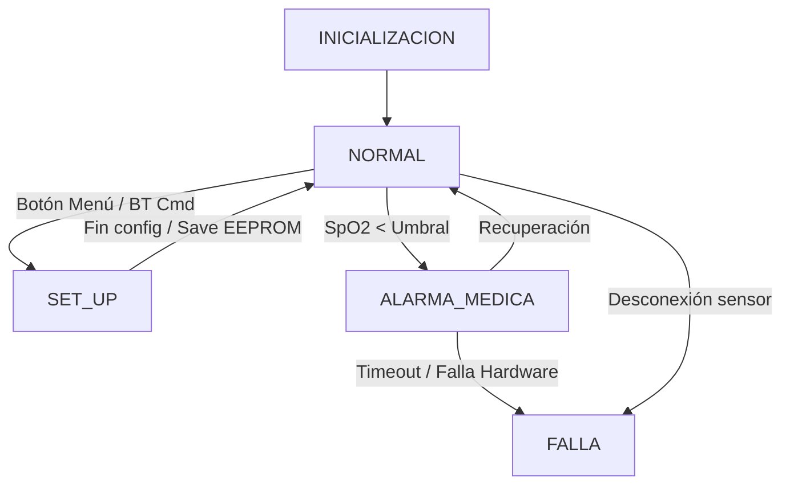

**UNIVERSIDAD DE BUENOS AIRES**  
**Facultad de Ingeniería**  
**TA134 – Taller de Sistemas Embebidos**  

Memoria del Trabajo Final:

# Monitor Multiparamétrico de Signos Vitales (MMSV)

**Autores:** 
BONACORSI, Lautaro Quimey — Legajo: 110115 
BONFIGLIO, Guido Martin — Legajo: 104884 
TALARICO, Jonatan Axel — Legajo: 89396 

Este trabajo fue realizado en la Ciudad Autónoma de Buenos Aires,
entre marzo y julio de 2026.

---

# RESUMEN

En el presente trabajo se diseñó e implementó un monitor de signos vitales portátil orientado al seguimiento de pacientes en tiempo real. El dispositivo, bautizado como Monitor Multiparamétrico de Signos Vitales (MMSV), es capaz de medir de manera continua la saturación de oxígeno en sangre (SpO2) y la frecuencia cardíaca mediante el sensor óptico MAX30102.

Para alertar sobre situaciones críticas de hipoxia o desconexiones, cuenta con un sistema de alarmas médicas configurables, tanto visuales como sonoras, así como con visualización local en un display LCD de 16x2. Además, integra un módulo Bluetooth (HM-10) que transmite de forma ininterrumpida la telemetría a una aplicación móvil, lo cual permite la centralización de datos a distancia.

El desarrollo se llevó a cabo sobre una placa NUCLEO-F103RB, programada bajo una arquitectura Bare Metal guiada por eventos (Event-Triggered System). Su estructura se centra en un super-loop no bloqueante menor a 1 ms, garantizando una alta responsividad y sentando las bases de diseño para dispositivos biomédicos confiables.

---

# Registro de versiones

Tabla 0.1: Registro de versiones del documento
| Revisión | Cambios realizados | Fecha |
| :---: | --- | :---: |
| 1.0 | Creación del documento | 10/07/2026 |

---

# Índice General

- [Registro de versiones](#registro-de-versiones)
- [Introducción general](#capítulo-1)
  - [1.1 Objetivo del proyecto](#11-objetivo-del-proyecto)
- [Introducción específica](#capítulo-2)
  - [2.1 Requisitos](#21-requisitos)
  - [2.2 Casos de uso](#22-casos-de-uso)
- [Diseño e implementación](#capítulo-3)
  - [3.1 Arquitectura general](#31-arquitectura-general)
  - [3.2 Diseño de hardware](#32-diseño-de-hardware)
  - [3.3 Diseño de firmware](#33-diseño-de-firmware)
- [Ensayos y resultados](#capítulo-4)
  - [4.1 Pruebas funcionales y de integración](#41-pruebas-funcionales-y-de-integración)
  - [4.2 Análisis de memoria](#42-análisis-de-memoria)
  - [4.3 Medición y análisis de tiempos (WCET)](#43-medición-y-análisis-de-tiempos-wcet)
  - [4.4 Cálculo del factor de uso de CPU (U)](#44-cálculo-del-factor-de-uso-de-cpu-u)
  - [4.5 Medición y análisis de consumo](#45-medición-y-análisis-de-consumo)
- [Conclusiones](#capítulo-5)
- [Bibliografía](#bibliografía)

---

# CAPÍTULO 1
# Introducción general

## 1.1 Objetivo del proyecto
El objetivo de este proyecto es diseñar e implementar un monitor de signos vitales portátil orientado al seguimiento de pacientes en tiempo real. Mide saturación de oxígeno en sangre (SpO2) y frecuencia cardíaca mediante el sensor MAX30102. Cuenta con un sistema de alarmas médicas configurables, visualización local en display LCD 16x2 y transmisión constante vía Bluetooth (HM-10) hacia una app móvil.

---

# CAPÍTULO 2
# Introducción específica

## 2.1 Requisitos
A continuación, se listan los requisitos establecidos para el desarrollo (Hardware y Software obligatorio y adicional):

Tabla 2.1: Requisitos obligatorios y adicionales
| Grupo | ID | Descripción |
| :---- | :---- | :---- |
| **Hardware Obligatorio** | 1.1 | Se utiliza un DIP Switch de 4 posiciones para seleccionar el perfil de paciente inicial. |
| | 1.2 | Botones (4) para interacción con el menú local y Acknowledge (silenciador de alarmas). |
| | 1.3 | Indicadores LED (amarillo/rojo) y Buzzer PWM para alarmas críticas. |
| | 1.4 | Módulo HM-10 (UART) para telemetría Bluetooth constante. |
| | 1.5 | Memoria EEPROM I2C para almacenamiento del SET_UP y eventos. |
| | 1.6 | El sistema no usa protoboards ni cables Dupont. Todo está interconectado mediante placa base y conectores/cables soldados. |
| **Hardware Adicional** | 2.1 | Sensor analógico biométrico MAX30102 (I2C + INT). |
| | 2.2 | Display LCD 16x2 I2C para visualización fluida de menú interactivo. |
| | 2.3 | Adaptador de niveles lógicos TXB0108 (3.3V a 5V) para display. |
| **Software Obligatorio** | 3.1 | Arquitectura Bare Metal, Event-Triggered System con Super-Loop < 1mS. |
| | 3.2 | Base de tiempo SysTick de 1ms; tareas no bloqueantes e implementación de rutinas Sleep/Bajo Consumo. |
| **Software Adicional** | 4.1 | Gestión concurrente y asincrónica del bus I2C (EXTI para MAX30102). |

## 2.2 Casos de uso
En esta sección se detallan las situaciones de operación previstas para el Monitor Multiparamétrico.

Tabla 2.2: Caso de uso 1 - Detección y alerta de Hipoxia
| Elemento | Definición |
| --- | --- |
| **Disparador** | El sistema calcula que el SpO2 está por debajo del límite seguro guardado. |
| **Flujo básico** | 1. Sensor informa valor bajo. 2. Super-Loop detecta anomalía. 3. Transición al estado ALARMA_MEDICA. 4. Buzzer y LED Rojo se activan (no bloqueante). 5. Se envía trama ALERTA_CRITICA por Bluetooth. |
| **Alternativas** | Si un enfermero pulsa Acknowledge, se silencia la alarma temporalmente. Si el valor se recupera, el sistema retorna al estado NORMAL automáticamente. |

Tabla 2.3: Caso de uso 2 - Configuración de umbrales
| Elemento | Definición |
| --- | --- |
| **Disparador** | Modificación de los límites de alarma del equipo (vía App o local). |
| **Flujo básico** | 1. Se recibe comando por UART o botón ingresando al estado SET_UP. 2. Se actualizan variables de límite. 3. Se graban los nuevos límites en EEPROM vía I2C. 4. Se confirma en LCD y retorna a NORMAL. |

Tabla 2.4: Caso de uso 3 - Falla por desconexión
| Elemento | Definición |
| --- | --- |
| **Disparador** | Desconexión abrupta del sensor MAX30102. |
| **Flujo básico** | 1. Rutina de I2C detecta Timeout/NACK. 2. Aborto de muestreo y salto a estado FALLA. 3. Display muestra "ERR: SENSOR". 4. LED amarillo y pitido lento indican alarma técnica (requiere reinicio). |

---

# CAPÍTULO 3
# Diseño e implementación

## 3.1 Arquitectura general
El diseño separa claramente el bloque de procesamiento y control (STM32) de los bloques de instrumentación (MAX30102 a 3,3 V) y visualización (LCD a 5 V). La arquitectura del firmware sigue un ciclo ejecutivo cíclico (super-loop) con un esquema de interrupciones que liberan la carga de CPU (por ejemplo, usar EXTI del MAX30102 en lugar de polling).

## 3.2 Diseño de hardware
* [En esta sección, detallar decisiones de diseño de la PCB o placa base, soldadura, y ubicación física].

### 3.2.1 Esquema Eléctrico
  
Figura 3.1: Diagrama esquemático del circuito completo.

### 3.2.2 Cableado y Montaje
  
Figura 3.2: Ensamblado sobre placa base con componentes soldados.

## 3.3 Diseño de firmware
El firmware incluye 5 estados principales en su máquina de estados (FSM):
1. INICIALIZACION
2. NORMAL
3. SET_UP
4. ALARMA_MEDICA
5. FALLA

Se adjunta un diagrama de estados conceptual:

---

# CAPÍTULO 4
# Ensayos y resultados

## 4.1 Pruebas funcionales y de integración
Se validó la interacción completa del sistema sin protoboards, verificando las respuestas de alarma, la visualización de datos de oxigenometría y el funcionamiento de la aplicación por Bluetooth.

Video Demostrativo del Trabajo Final:  
[Ver Video de Prueba de Integración](https://tu_link_al_video)

## 4.2 Análisis de memoria
A continuación, se detalla el uso de recursos tras la compilación final (adjuntar captura de pantalla de STM32CubeIDE).

  
Figura 4.1: Reporte del Build Analyzer.

* Secciones (Bytes):
  * .text (Código/constantes): [XX] bytes
  * .data (Variables inicializadas): [XX] bytes
  * .bss (Variables no inicializadas): [XX] bytes
* Regiones:
  * FLASH: [XX] bytes ([XX]%)
  * RAM: [XX] bytes ([XX]%)

## 4.3 Medición y análisis de tiempos (WCET)
El análisis se ejecutó usando el contador de ciclos del procesador (DWT->CYCCNT).

Tabla 4.1: Peores tiempos de ejecución medidos
| Tarea | WCET [µs] | Observaciones de peor caso |
| :--- | :---: | :--- |
| task_system_update() | [XX] | Salto a ALARMA_MEDICA tras cálculo. |
| task_sensor_update() | [XX] | Lectura FIFO completa del MAX30102 (vía I2C). |
| task_bluetooth_update() | [XX] | Tramas largas por UART. |
| task_actuator_update() | [XX] | Actualización intensa del LCD. |

Conclusión parcial: La sumatoria máxima cumple holgadamente la condición menor a 1000 µs exigida para el super-loop.

## 4.4 Cálculo del factor de uso de CPU (U)
Sabiendo que U = Σ (WCET / T):

* Usystem = WCET_system / T_system = [XX]
* Usensor = WCET_sensor / T_sensor = [XX]
* Ubluetooth = [XX]
* Uactuator = [XX]

Factor de Uso Total (U): [XX] %

## 4.5 Medición y análisis de consumo
Se utilizó amperímetro en los rieles de 5 V y 3,3 V, y osciloscopio para detectar los picos de las transmisiones.

Tabla 4.2: Consumo energético medido
| Estado | Riel | Corriente Pico | Potencia | Observaciones |
| :--- | :---: | :---: | :---: | :--- |
| Normal | 5 V | [X] mA | [X] mW | BT + LCD activo. |
| Normal | 3,3 V | [X] mA | [X] mW | Procesamiento y lectura sensor I2C. |
| Bajo Consumo | 5 V | [X] mA | [X] mW | Modo sleep (LCD off / BT low power). |
| Bajo Consumo | 3,3 V| [X] mA | [X] mW | Sistema en estado WFI. |

---

# CAPÍTULO 5
# Conclusiones

[Redactar conclusión]

---

# Bibliografía
